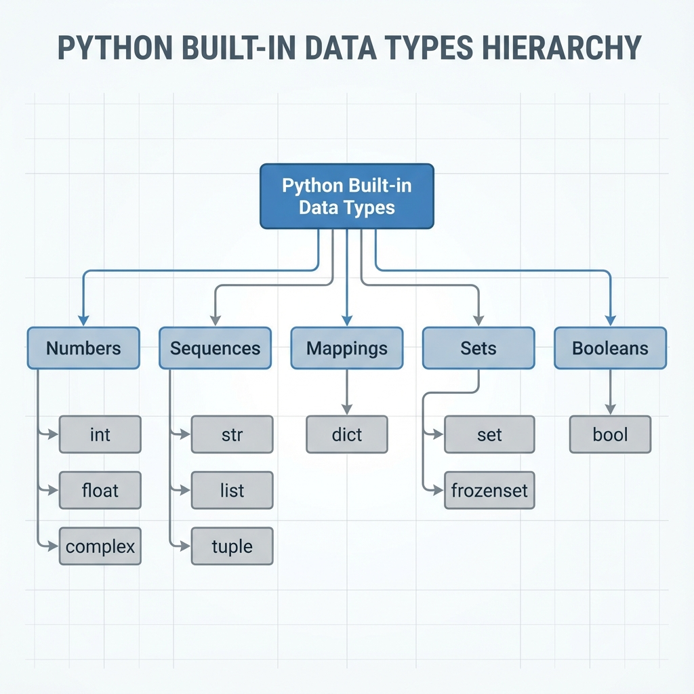

# Data Types & Operators

## 1. Topic definition
Data types describe the kind of value a variable holds (int, float, str, bool, etc.). Operators manipulate those values.

## 2. Why they exist
- Provide a predictable way to store, retrieve, and compute data.
- Enable mathematical, logical, and collection operations.

## 3. Real‑world usage
- Numerical calculations (finance, physics)
- Text processing (logs, reports)
- Feature flags and permission checks

## 4. Key Rules & Syntax
Python is **dynamically typed**, meaning you don't need to declare a variable's type. However, it is **strongly typed**, so Python won't implicitly convert incompatible types (e.g., adding a string to an integer).

### 4.1. Core Data Types
| Type   | Category | Mutability | Description |
|--------|----------|------------|-------------|
| `int`    | Numeric | Immutable | Whole numbers (arbitrarily large). |
| `float`  | Numeric | Immutable | Floating-point numbers (IEEE 754). |
| `str`    | Sequence | Immutable | Unicode character sequences. |
| `bool`   | Numeric | Immutable | Boolean values (`True`, `False`). |
| `list`   | Sequence | Mutable   | Ordered collection of items. |
| `tuple`  | Sequence | Immutable | Ordered, read-only collection. |
| `dict`   | Mapping  | Mutable   | Key-value pairs (hash table). |
| `set`    | Set      | Mutable   | Unordered collection of unique items. |

### 4.2. Operator Precedence
When multiple operators are used in one expression, Python follows a specific order of execution (PEMDAS/BODMAS).

| Precedence | Operator | Description |
|------------|----------|-------------|
| 1 (Highest) | `()` | Parentheses |
| 2 | `**` | Exponentiation |
| 3 | `* / // %` | Multiplication, Division, etc. |
| 4 | `+ -` | Addition, Subtraction |
| 5 | `== != > <` | Comparison Operators |
| 6 | `not and or` | Logical Operators |

## 5. Step‑by‑step explanation of examples
See **examples.py** for practical demonstrations.

## 6. Chapter layout
Same as other chapters.
