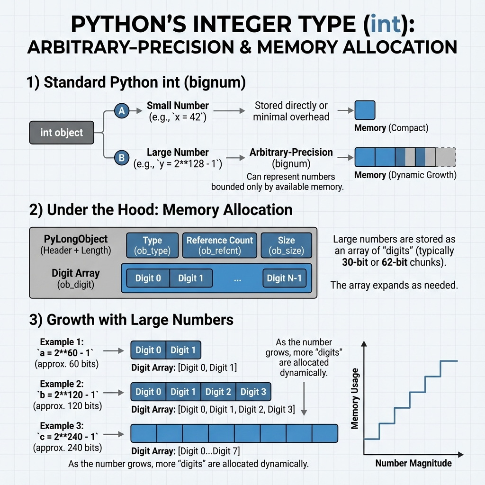
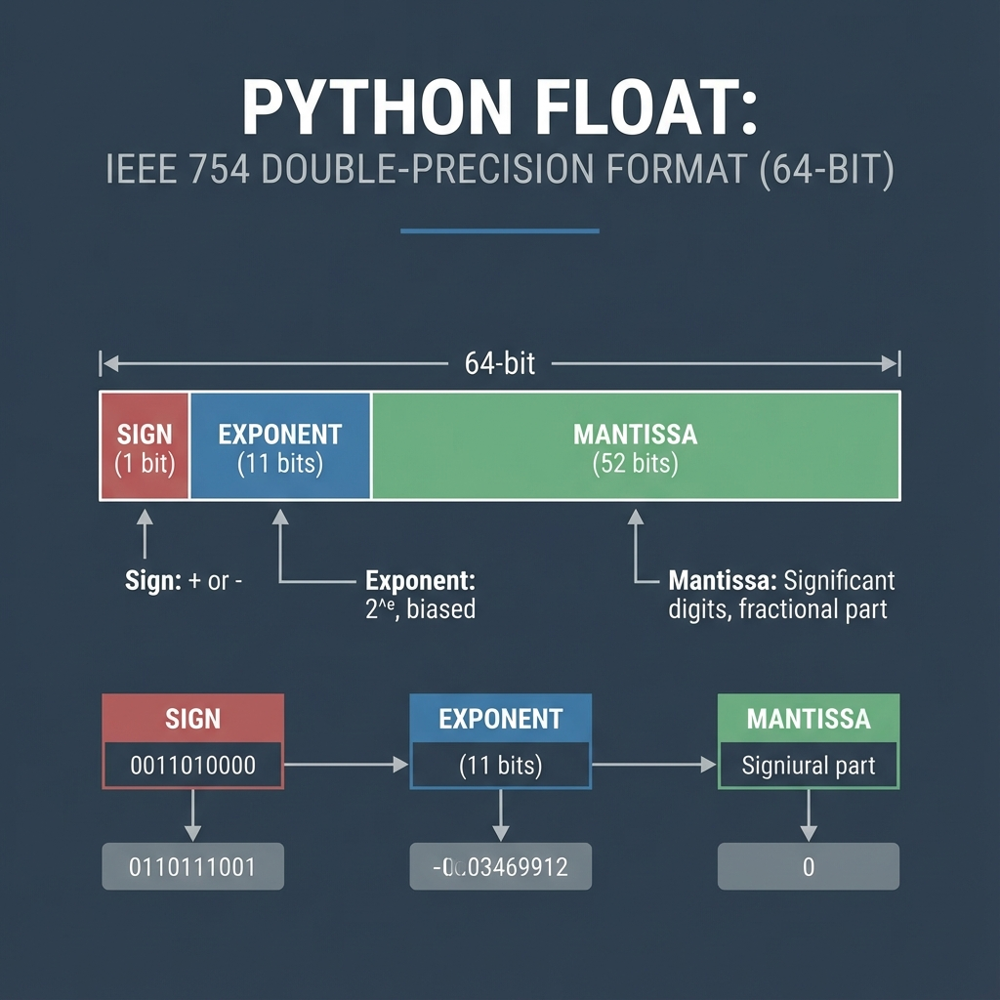
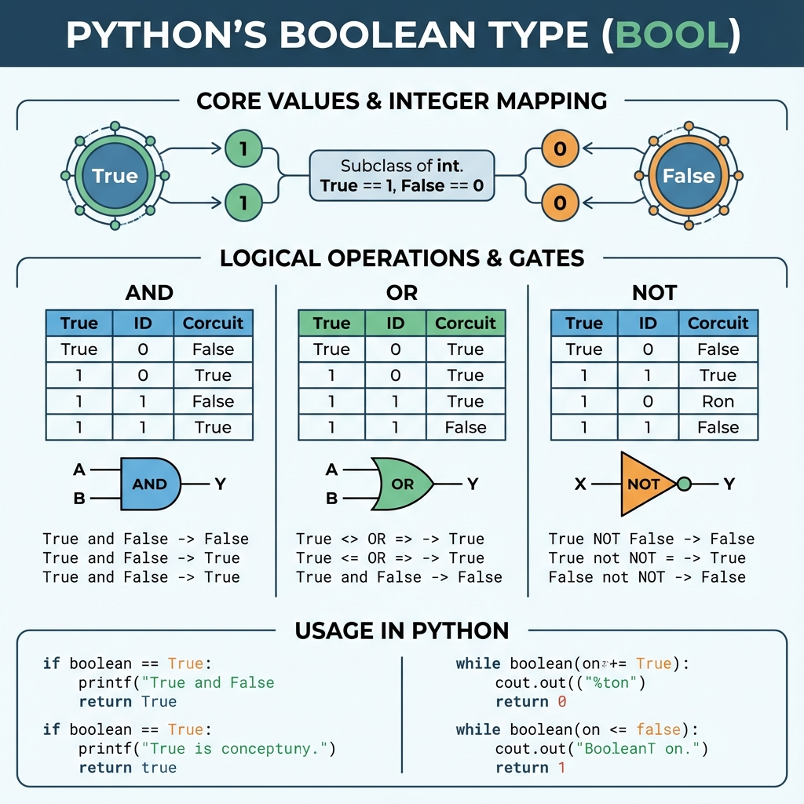
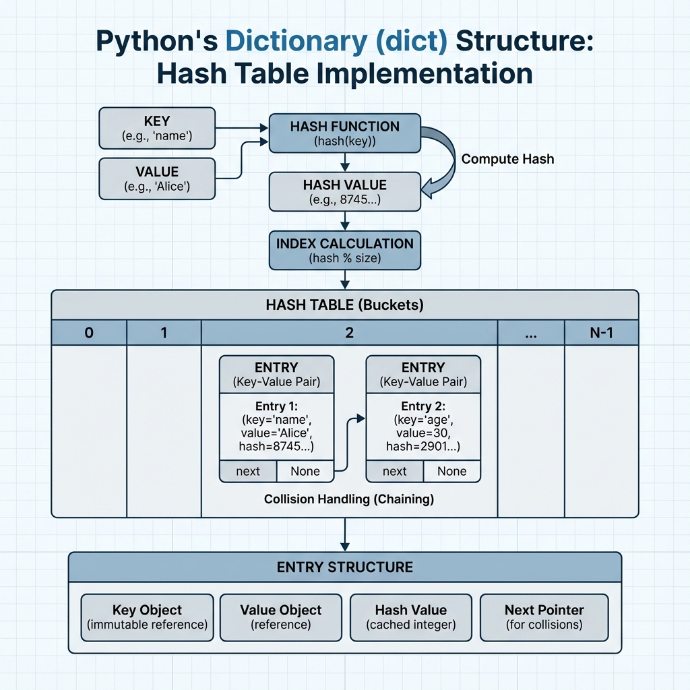
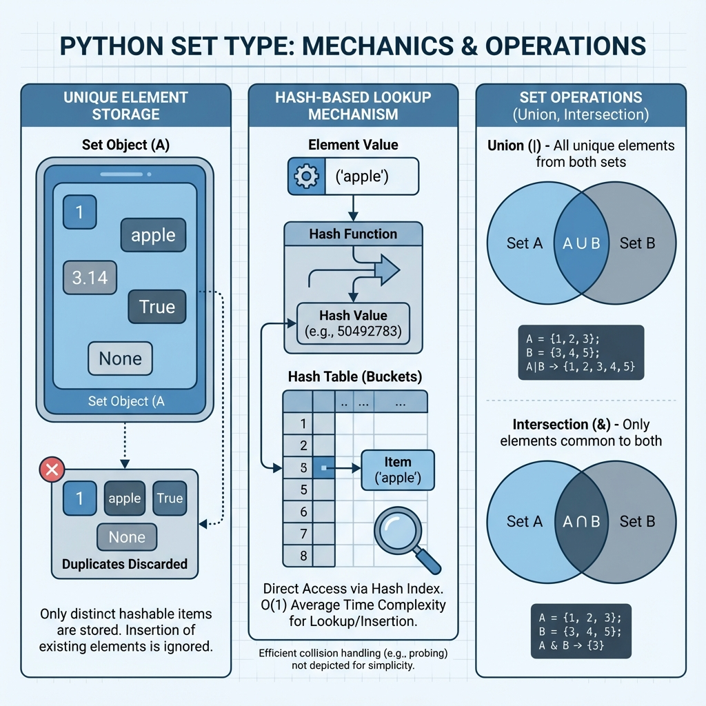
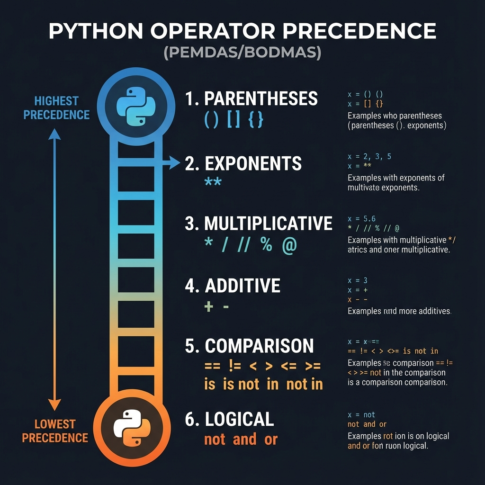

# Data Types & Operators

## 1. Topic definition
Data types describe the kind of value a variable holds (int, float, str, bool, etc.). Operators manipulate those values.

## 2. Why they exist
- Provide a predictable way to store, retrieve, and compute data.
- Enable mathematical, logical, and collection operations.

## 3. Real‑world usage
- Numerical calculations (finance, physics)
- Text processing (logs, reports)
- Feature flags and permission checks

## 4. Technical Deep-Dive: Individual Data Types

### 4.1. Integers (`int`)
Python integers have **arbitrary precision**, meaning they are bounded only by the available memory. This is achieved through a "bignum" implementation where large numbers are stored in an array of digits.

- **Memory**: Standard 64-bit integers are small objects, but large integers grow dynamically.
- **Operations**: Fast for common sizes, but performance degrades for astronomically large numbers.

### 4.2. Floating-Point Numbers (`float`)
Python floats are implemented using binary floating-point arithmetic following the **IEEE 754** double-precision standard (64-bit).

- **Structure**: 1 sign bit, 11 exponent bits, and 52 mantissa/fraction bits.
- **Precision**: Provides approximately 15-17 significant decimal digits.

### 4.3. Booleans (`bool`)
The `bool` type is a subclass of `int`. There are only two instances: `True` (effectively `1`) and `False` (effectively `0`).

- **Logic**: Used in control structures (if/while) and logical expressions (`and`, `or`, `not`).

### 4.4. Dictionaries (`dict`)
Dictionaries are the most optimized collection in Python, implemented as a **Highly Tuned Hash Table**.

- **Complexity**: Average O(1) for lookups, insertions, and deletions.
- **Keys**: Must be hashable (immutable) to ensure consistent index calculation.

### 4.5. Sets (`set`)
A set is an unordered collection of unique, hashable items. Under the hood, it uses a hash table similar to a dictionary but without values.

- **Uniqueness**: Automatically discards duplicate entries.
- **Operations**: Highly efficient for mathematical operations like Union (`|`), Intersection (`&`), and Difference (`-`).

## 5. Operator Precedence
When multiple operators are used in one expression, Python follows a specific order of execution (PEMDAS/BODMAS).

| Precedence | Operator | Description |
|------------|----------|-------------|
| 1 (Highest) | `()` | Parentheses |
| 2 | `**` | Exponentiation |
| 3 | `* / // %` | Multiplication, Division, etc. |
| 4 | `+ -` | Addition, Subtraction |
| 5 | `== != > <` | Comparison Operators |
| 6 | `not and or` | Logical Operators |

## 5. Step‑by‑step explanation of examples
See **examples.py** for practical demonstrations.

## 6. Chapter layout
Same as other chapters.
