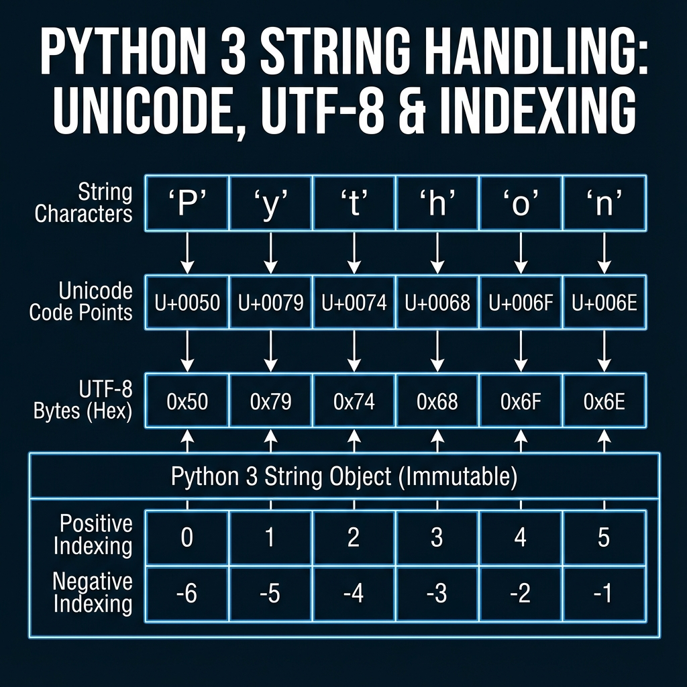
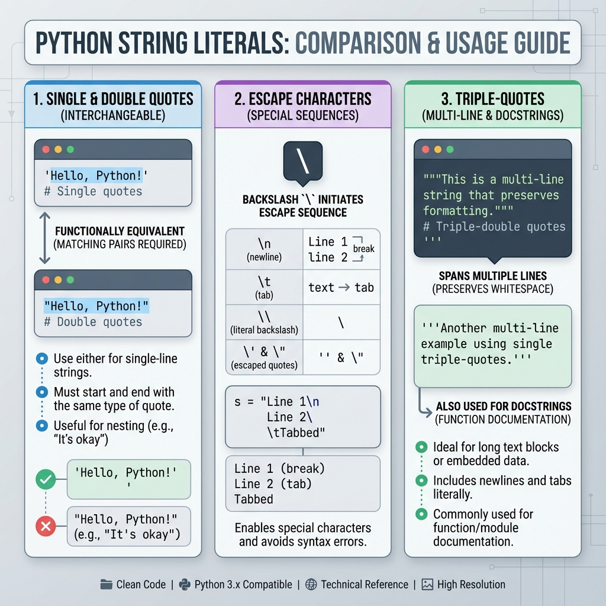
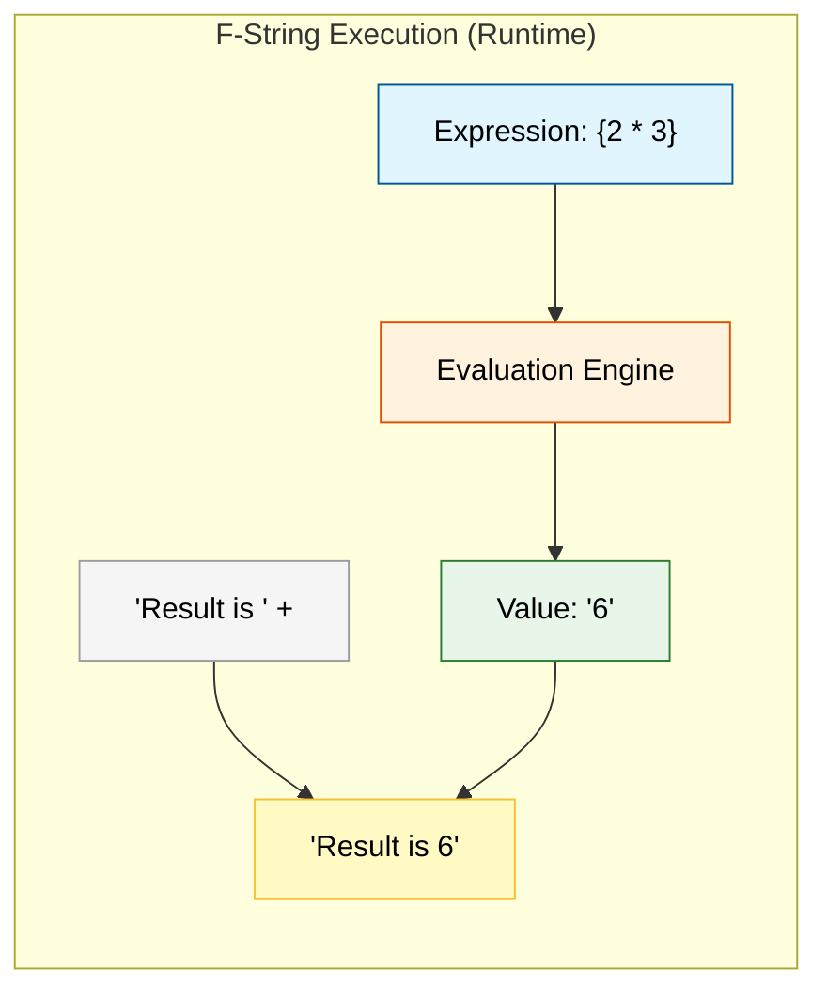
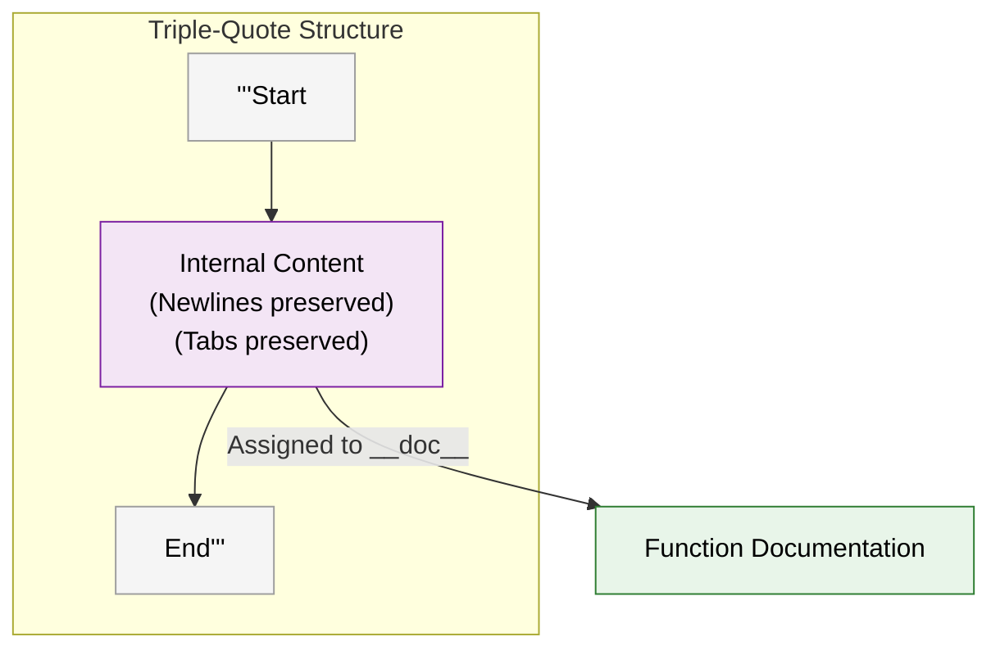

## 1. Topic Definition
A **String** in Python is an immutable sequence of Unicode characters. Python 3 treats all strings as Unicode by default, allowing for international character support.

## 2. Why Strings Exist
- To represent and manipulate text-based data.
- To handle communication between humans and machines (I/O).
- To store structured text formats like JSON, HTML, or CSV.

## 3. Real-World Usage
- Web development (rendering HTML templates).
- Data Science (parsing log files and cleaning datasets).
- Natural Language Processing (analyzing human speech or writing).

## 4. Technical Architecture: Unicode & Indexing
Python strings are highly optimized. Each character has a unique Unicode code point, and Python uses different internal representations (Latin-1, UCS-2, or UCS-4) depending on the characters present to save memory.



## 5. Technical Deep-Dive: String Variants

### 5.1. String Literals & Escape Sequences
Python allows both single (`'`) and double (`"`) quotes for string literals. Escape sequences allow for special characters like newlines (`\n`) and tabs (`\t`).



- **Best Practice**: Use `"` by default and `'` when the string itself contains double quotes.

### 5.2. Formatted String Literals (f-strings)
Introduced in Python 3.6 (PEP 498), f-strings are the fastest and most readable way to perform string interpolation. They are evaluated at **runtime**, allowing you to include any valid Python expression within curly braces `{}`.



- **Syntax**: `f"Value: {expression}"`.
- **Efficiency**: Faster than `.format()` and `%` because they are part of the grammar rather than constant string parsing.

### 5.3. Multi-line Strings & Docstrings
Triple quotes (`'''` or `"""`) allow strings to span multiple lines, preserving all whitespace, tabs, and newlines exactly as they appear in the source code.



- **Docstrings**: When placed as the first statement in a module, class, or function, the string is assigned to the object's `__doc__` attribute and can be accessed via `help(object)`.

## 6. String Immutability
Once a string is created, **it cannot be modified**. Any operation that seems to "change" a string actually creates a brand new string object in memory.
```python
s = "Hello"
s[0] = "h"  # Raises TypeError
```

## 7. Step‑by‑step explanation of examples
See **examples.py** for practical usage of slicing, formatting, and methods.

## 8. Chapter layout
Standard academic layout.
