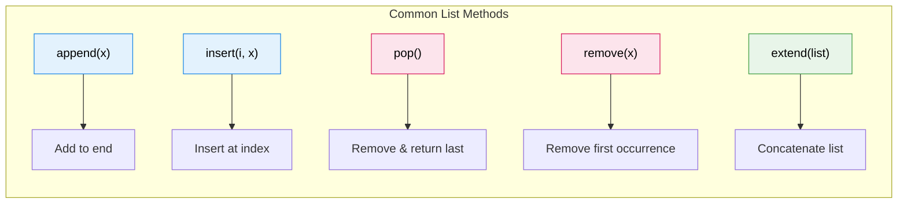
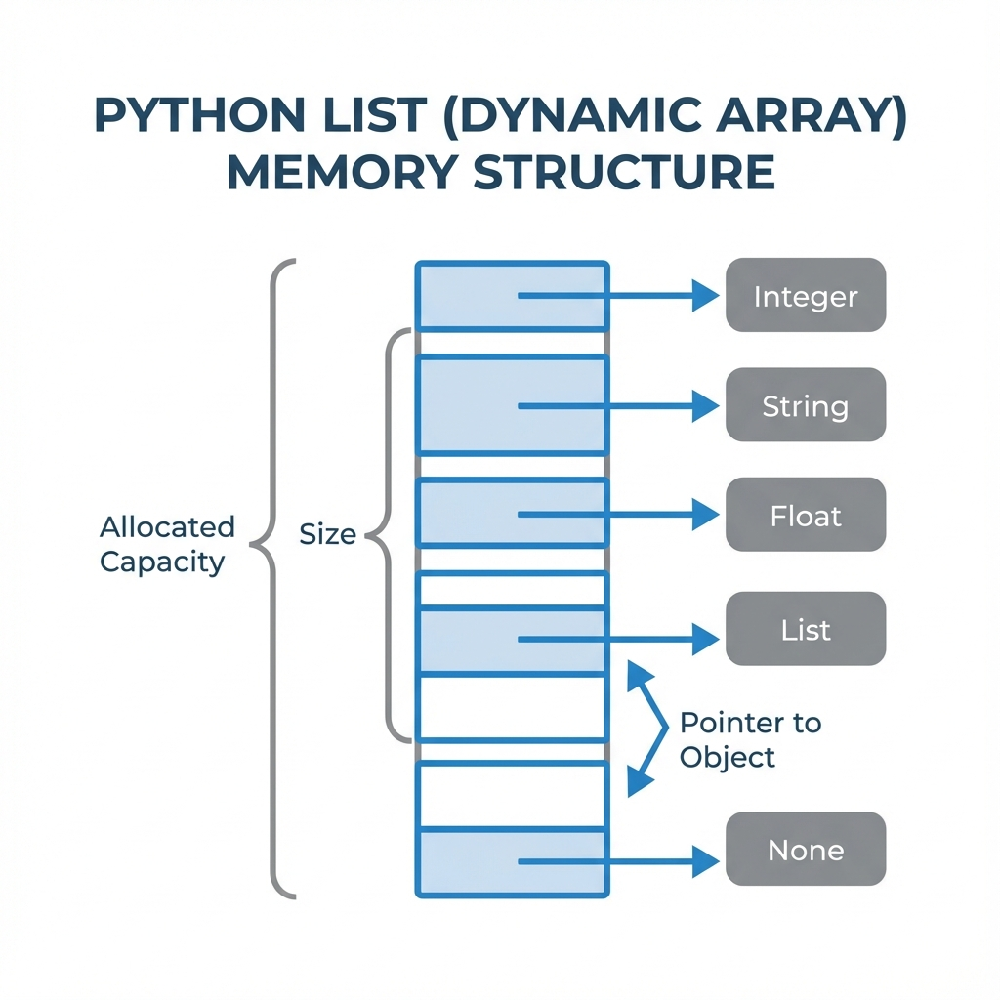
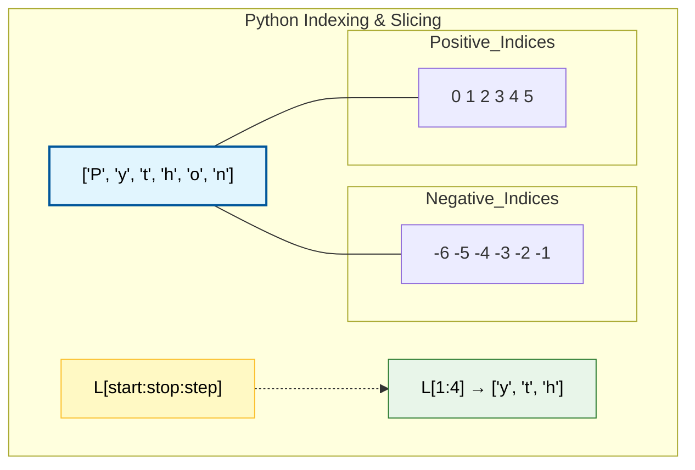

# Lists

## 1. Topic definition
A list is an ordered, mutable collection of items.

## 2. Why lists exist
- Store sequences of data (users, scores, filenames).
- Flexible sizing (grow/shrink dynamically).

## 3. Real‑world usage
- A shopping cart.
- Rows from a spreadsheet.
- A playlist of songs.

## 4. Key rules & syntax
| Rule | Example | Details |
|------|---------|---------|
| Literal | `[1, 2, 3]` | Square brackets define a list. |
| Indexing | `L[0]`, `L[-1]` | Access items by position (0-based). |
| Slicing | `L[1:3]` | Extract a sub-list (start:end). |
| `append(x)` | `L.append(4)` | Adds an item to the end. |
| `extend(iterable)` | `L.extend([5, 6])` | Appends items from another list. |
| `insert(i, x)` | `L.insert(0, 0)` | Inserts an item at a specific index. |
| `pop(i)` | `L.pop()` | Removes and returns the last item (or at index `i`). |
| `remove(x)` | `L.remove(1)` | Removes the first occurrence of `x`. |
| `sort()` | `L.sort()` | Sorts the list in-place. |
| `reverse()` | `L.reverse()` | Reverses the list in-place. |
| `clear()` | `L.clear()` | Removes all items from the list. |

## 5. Memory Management (Dynamic Arrays)
Python lists are implemented as **dynamic arrays**. This provides high performance for common operations:
- **Over-allocation**: Python allocates more memory than strictly needed to accommodate future growth.
- **Resizing**: When the allocated space is exhausted, Python automatically allocates a larger block and migrates items.
- **Performance**: This architecture ensures that `append` operations have an **Amortized O(1)** time complexity.

## 6. Slicing Deep Dive
Slicing allows you to get parts of a list using `list[start:stop:step]`.
- `L[:2]` - from the beginning to index 2 (exclusive).
- `L[1:]` - from index 1 to the end.
- `L[::2]` - every second item (step size 2).
- `L[::-1]` - reverse the list.

## 7. Step‑by‑step explanation of examples
See **examples.py**.

## 8. Chapter layout
Standard layout.
