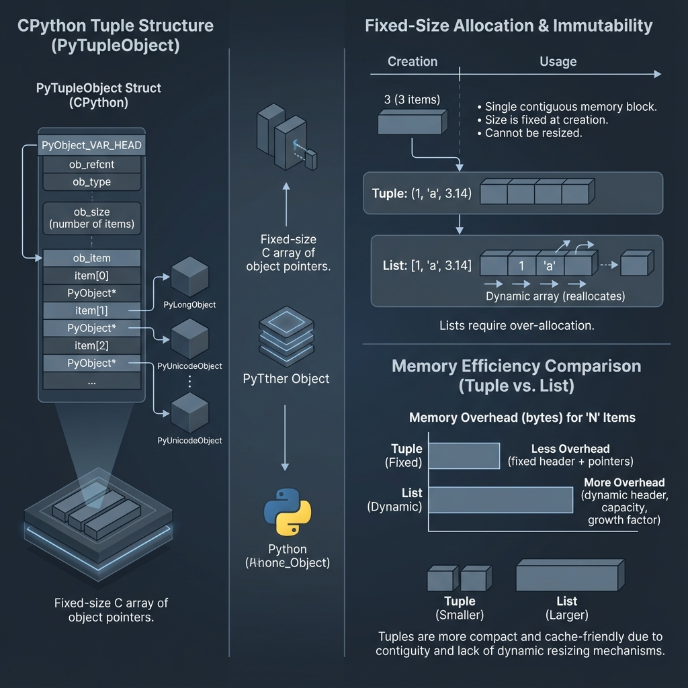
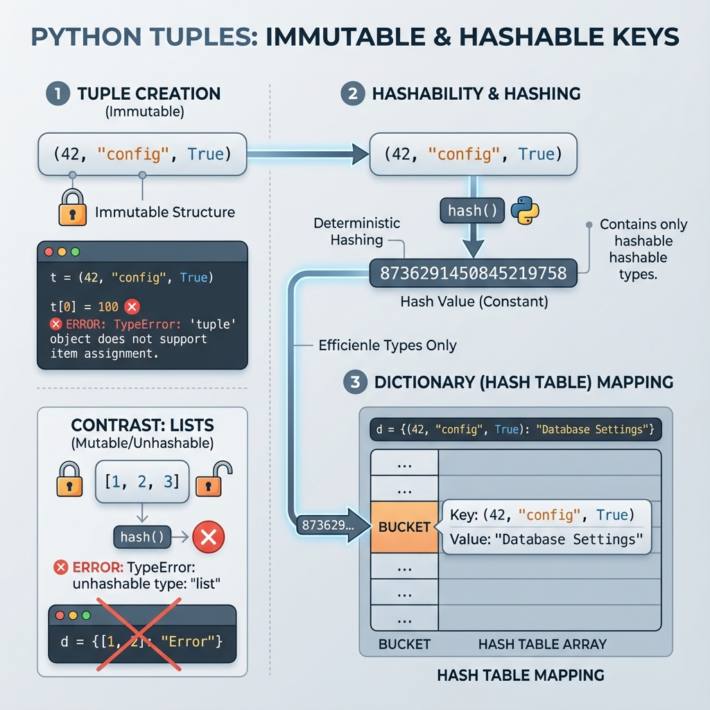
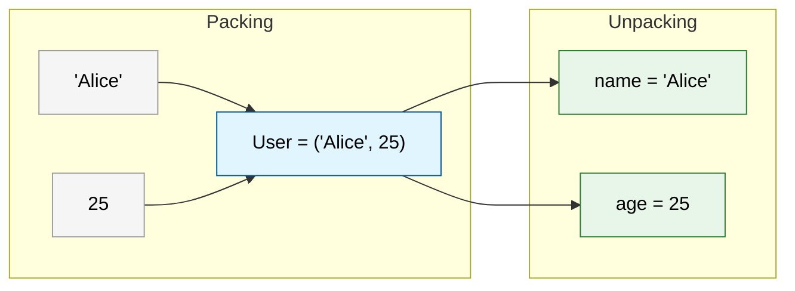

# Tuples

## 1. Topic definition
A tuple is an ordered, immutable collection of items.

## 2. Why tuples exist
- Provide read‑only sequences.
- Can be used as dictionary keys because they are hashable.
- Convey intent that data should not change.

## 3. Real‑world usage
- Returning multiple values from a function.
- Storing (x, y) coordinates.
- Fixed configuration sets.

## 4. Technical Architecture: Memory Optimization
Tuples are **fixed-size** and more memory-efficient than lists. Because they are immutable, Python can allocate a single contiguous block of memory for the tuple at creation time without needing the "over-allocation" overhead that lists require for dynamic resizing.



### 4.1. Comparison: Over-allocation
| Feature | List (Dynamic) | Tuple (Fixed) |
|---------|----------------|---------------|
| Memory Block | Can be reallocated | Single contiguous block |
| Size | `ob_size` + `allocated` | Exactly `ob_size` |
| Overhead | Growth factor (typically 1.125x) | Minimal (PyObject header) |

## 5. Immvutability & Hashability
Tuples are **immutable**—once created, they cannot be changed. This property leads to **Hashability**, which is critical for using tuples as identifiers.



- **Security**: Ensures data (like database credentials or coordinates) remains constant.
- **Dictionary Keys**: A tuple can be used as a key in a dictionary because its hash value will never change during its lifetime.
  ```python
  # Valid: Tuple as a key
  locations = { (40.7128, -74.0060): "New York" }
  ```

## 6. Tuple Operations: Packing & Unpacking
One of the most powerful features of tuples is the ability to pack and unpack values seamlessly.



### 6.1. Special Syntax
- **Single-element Tuple**: `t = (42,)` (The comma is required, otherwise it's just an integer in parentheses).
- **Function Returns**: Functions often return multiple values as a tuple, which can then be unpacked.
  ```python
  def get_coords():
      return 10.5, 20.1  # Returns a tuple

  x, y = get_coords()  # Unpacking
  ```

## 7. Lists vs. Tuples: The Final Verdict
| Feature | List | Tuple |
|---------|------|-------|
| Mutability | Mutable | Immutable |
| Performance | Slower (Resizing) | Faster (Fixed) |
| Safety | Low (Can be modified) | High (Read-only) |
| Use Case | Item collections | Record-like data / Keys |

## 8. Step‑by‑step explanation of examples
See [examples.py](file:///c:/Users/spide/OneDrive/Documents/my-python-notebook/05_Tuples/examples.py).
