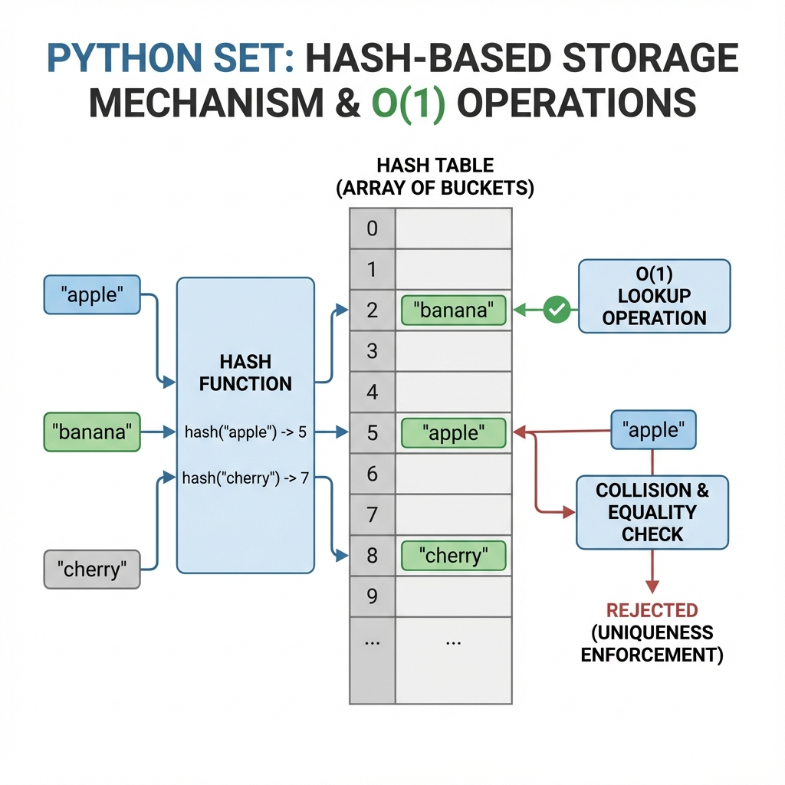
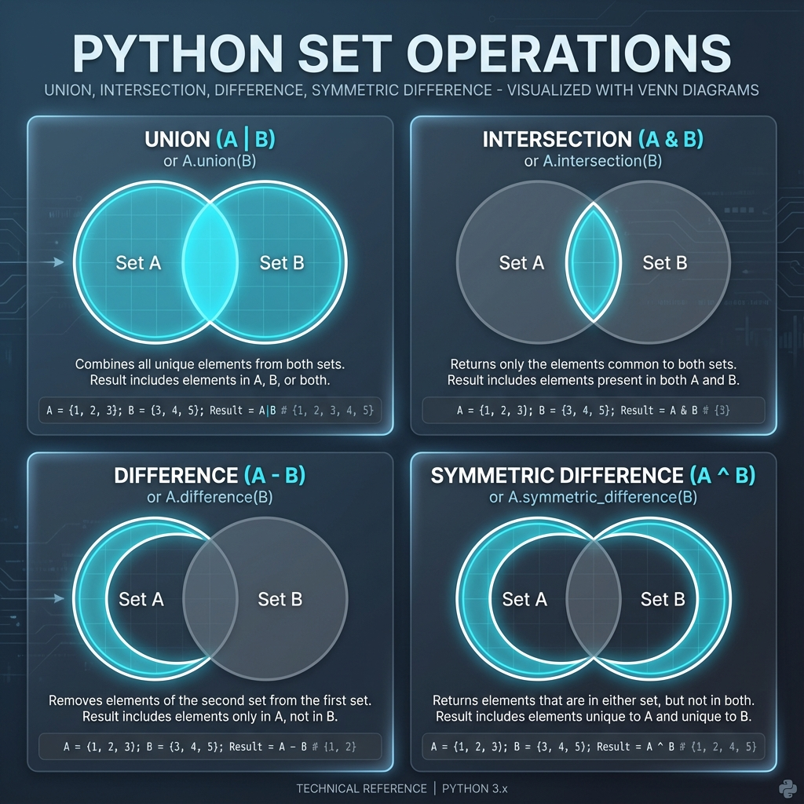
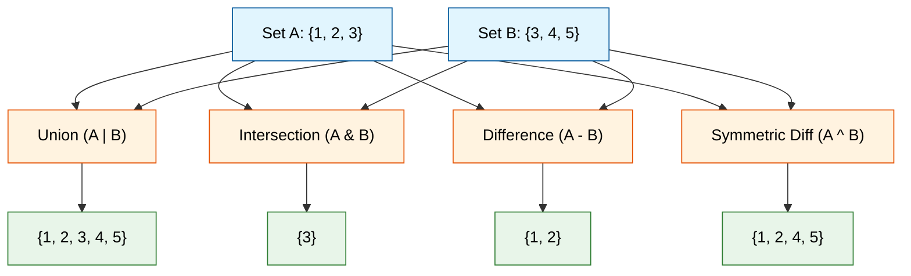
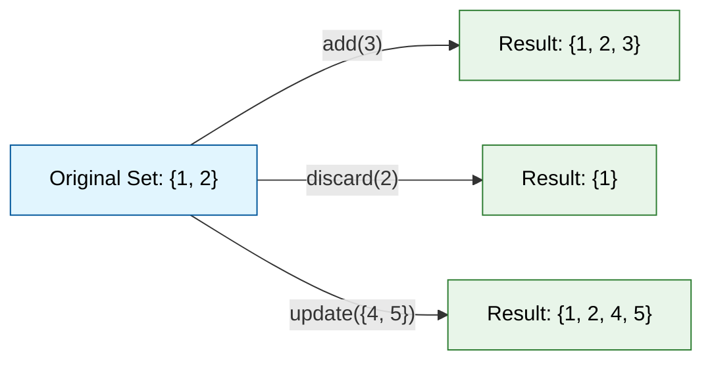

# Sets

## 1. Topic definition
A set is an unordered collection of **unique** hashable items.

## 2. Why sets exist
- Fast membership testing (`O(1)` average).
- Automatic duplicate removal.
- Useful for mathematical operations (union, intersection, difference).

## 3. Real‑world usage
- Removing duplicate entries from a list of emails.
- Checking if a user ID already exists.
- Performing tag‑based searches.

## 4. Technical Architecture: Hash-Based Uniqueness
Sets use a **hash table** internally (similar to dictionaries but without values), which provides O(1) average-case performance for membership testing, insertion, and deletion. The hash-based structure automatically enforces uniqueness.



### 4.1. How Sets Enforce Uniqueness
When you add an item to a set, Python:
1. Computes the **hash** of the item
2. Checks if that hash already exists in the hash table
3. If it exists, the item is **not added** (automatic deduplication)
4. If it doesn't exist, the item is added

## 5. Set Operations: Mathematical Power
Sets in Python support all standard mathematical set operations with both methods and operators.



### 5.1. Core Operations



| Operation | Operator | Method | Description |
|-----------|----------|--------|-------------|
| Union | `A \| B` | `A.union(B)` | All elements from both sets |
| Intersection | `A & B` | `A.intersection(B)` | Only elements in both sets |
| Difference | `A - B` | `A.difference(B)` | Elements in A but not in B |
| Symmetric Difference | `A ^ B` | `A.symmetric_difference(B)` | Elements in either set, but not both |

## 6. Set Methods & Modification

### 6.1. Adding and Removing


- **`add(item)`**: Adds a single element
- **`discard(item)`**: Removes an element (no error if not found)
- **`remove(item)`**: Removes an element (raises KeyError if not found)
- **`update(iterable)`**: Adds multiple elements from an iterable

## 7. Real-World Applications

### 7.1. Duplicate Removal
```python
emails = ["user@example.com", "admin@site.com", "user@example.com"]
unique_emails = set(emails)  # {'user@example.com', 'admin@site.com'}
```

### 7.2. Membership Testing (Fast Lookups)
```python
valid_ids = {101, 102, 103, 104}
if user_id in valid_ids:  # O(1) operation
    grant_access()
```

## 8. Step‑by‑step explanation of examples
See [examples.py](file:///c:/Users/spide/OneDrive/Documents/my-python-notebook/06_Sets/examples.py).

## 9. References & Further Reading
- **Official Documentation**: [Python 3 Sets](https://docs.python.org/3/tutorial/datastructures.html#sets) - The authoritative source.
- **Real Python**: [Sets in Python](https://realpython.com/python-sets/) - A comprehensive guide to sets and their operations.
- **GeeksforGeeks**: [Python Sets](https://www.geeksforgeeks.org/python-sets/) - Detailed examples and method listings.
- **W3Schools**: [Python Sets](https://www.w3schools.com/python/python_sets.asp) - Beginner-friendly tutorials.
