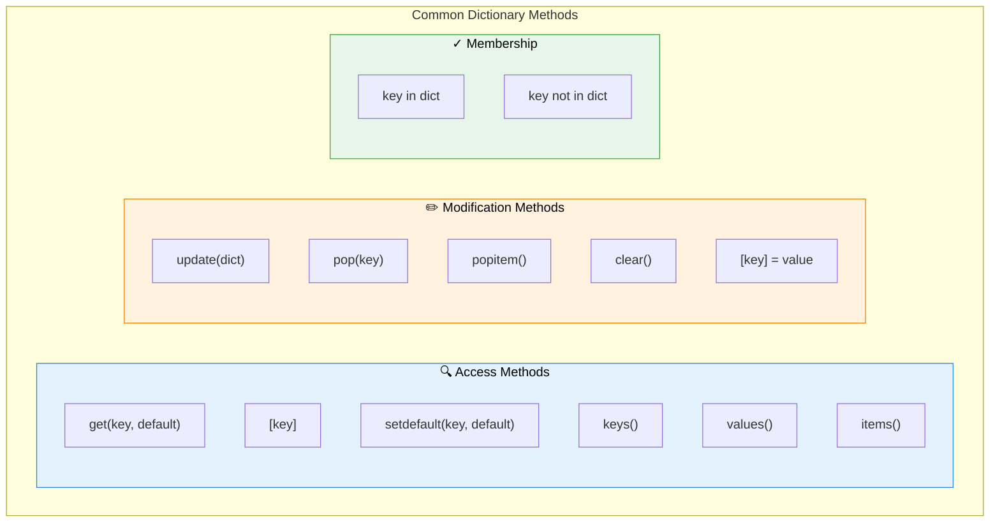
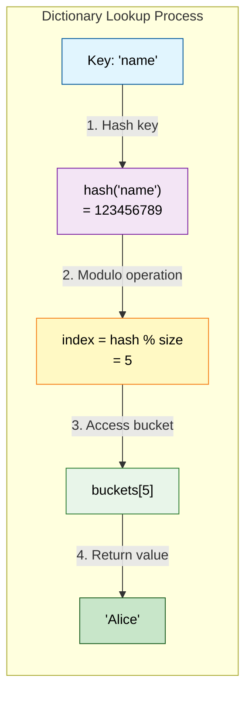
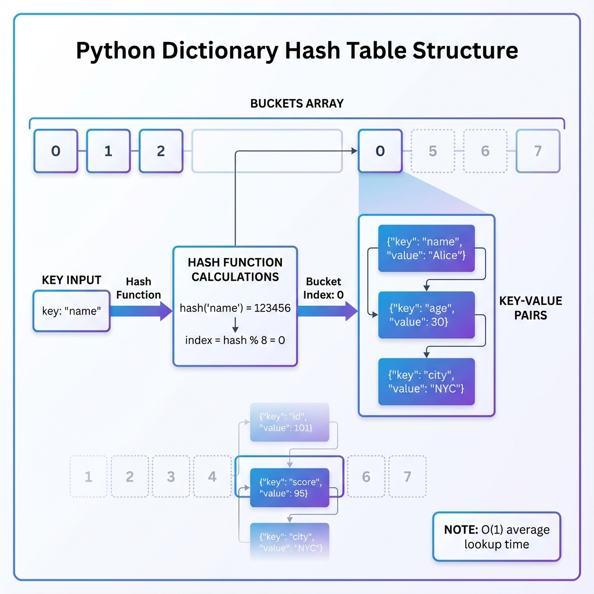
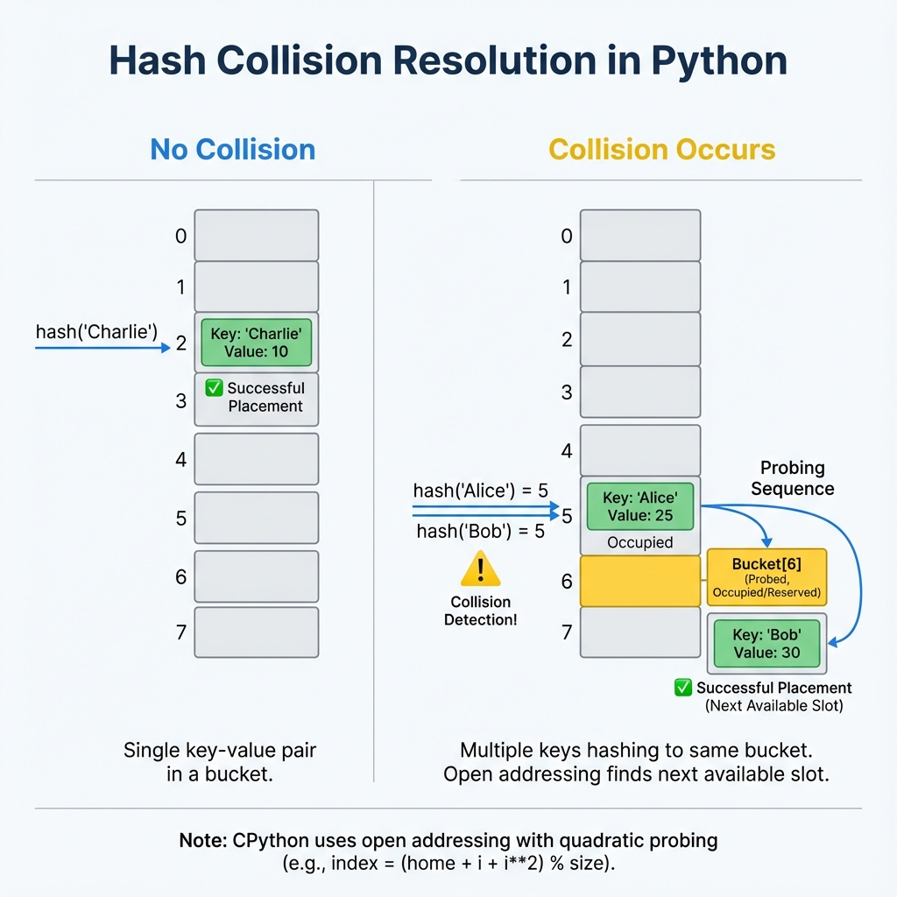
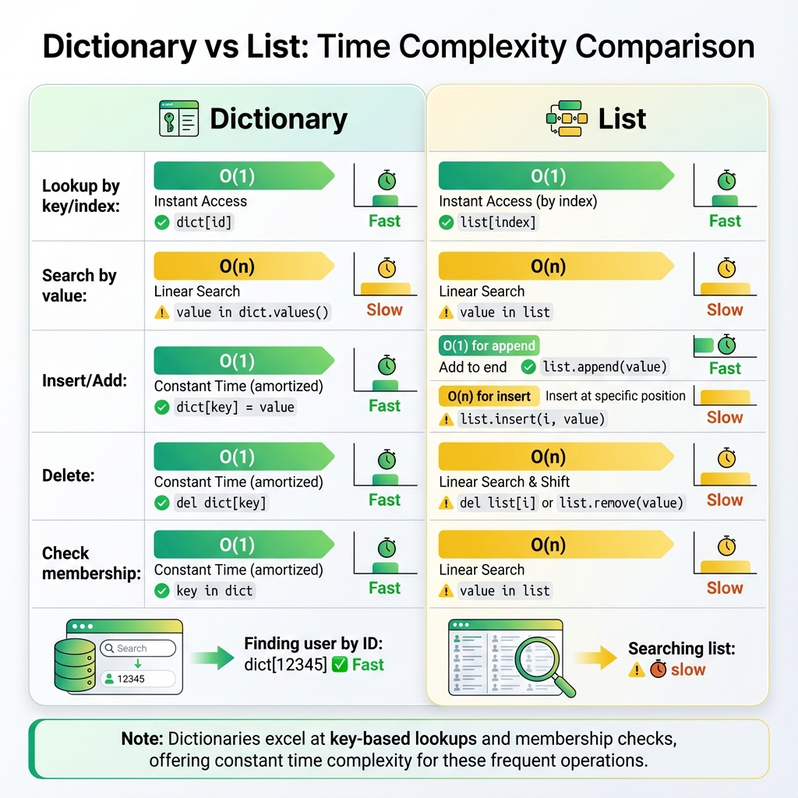
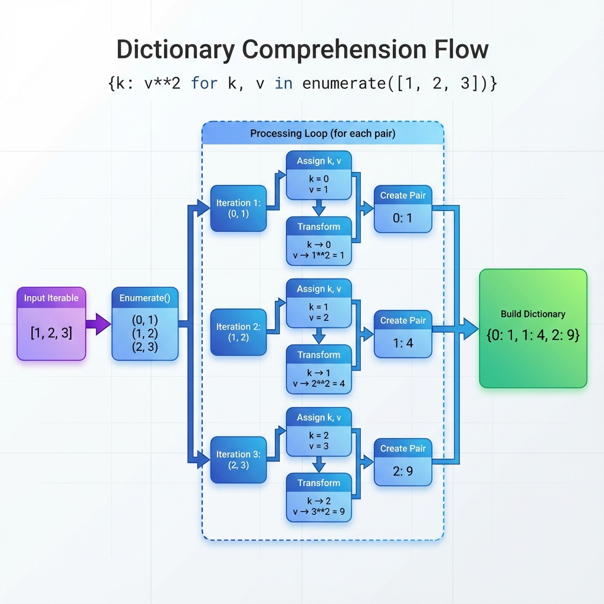

# Dictionaries

## 1. Topic Definition

A **dictionary** is a mutable, unordered collection of **key-value pairs** where each key is unique and must be **hashable** (immutable types like strings, numbers, or tuples). Dictionaries are Python's implementation of **hash tables**, providing extremely fast lookups, insertions, and deletions with an average time complexity of **O(1)**.

### Key Characteristics:
- **Mutable**: You can add, modify, or remove key-value pairs after creation
- **Unordered** (pre-Python 3.7) / **Insertion-ordered** (Python 3.7+): Maintains insertion order as of Python 3.7+
- **Keys must be hashable**: Only immutable types can be dictionary keys
- **Values can be any type**: No restrictions on value types
- **Fast lookups**: O(1) average time complexity for access operations

## 2. Why Dictionaries Exist

Dictionaries solve critical problems in data organization and retrieval:
- **O(1) average lookup, insertion, and deletion** - Dramatically faster than lists for key-based access
- **Model associative data** - Perfect for JSON objects, configuration tables, and database-like structures
- **Efficient counting and grouping** - Ideal for frequency counters, caching, and data aggregation
- **Memory-efficient key-value storage** - Better than maintaining parallel lists for related data

## 3. Real-World Usage

Dictionaries are ubiquitous in Python programming:
- **Configuration management**: Storing application settings and parameters
- **API responses**: Parsing and handling JSON data from web services
- **Caching and memoization**: Storing computed results for fast retrieval
- **Database ORM-style mapping**: Representing database records as dictionaries
- **Counting and analytics**: Word frequency analysis, event counting
- **Graph representations**: Adjacency lists for graph algorithms
- **State management**: Maintaining application state in web frameworks

## 4. Key Rules & Syntax

| Rule | Example | Details |
|------|---------|---------|
| Literal | `{"a": 1, "b": 2}` | Curly braces with key:value pairs |
| Empty dict | `{}` or `dict()` | Creates an empty dictionary |
| Access | `d["a"]` | Raises KeyError if key doesn't exist |
| Get with default | `d.get("c", 0)` | Returns default if key missing |
| Set/Update | `d["c"] = 3` | Adds new key or updates existing |
| Update multiple | `d.update({"d": 4})` | Merges another dictionary |
| Delete | `del d["b"]` | Removes key-value pair |
| Pop | `d.pop("a", None)` | Removes and returns value |
| Dictionary comprehension | `{k: v*2 for k, v in d.items()}` | Creates dict from iterable |
| Merge (3.9+) | `d1 \| d2` | Combines two dictionaries |



## 5. Hash Tables Deep Dive

Python dictionaries are implemented using **hash tables**, a data structure that provides exceptional performance for key-based operations.

### How Hash Tables Work:

1. **Hash Function**: When you store a key-value pair, Python computes a hash of the key using the `hash()` function
2. **Bucket Index**: The hash value is converted to an index in an internal array (buckets)
3. **Storage**: The key-value pair is stored at that bucket location
4. **Lookup**: To retrieve a value, Python hashes the key again, finds the bucket, and returns the value





### Hashable vs Non-Hashable Types:

**✅ Hashable (Can be dictionary keys):**
- Strings: `"hello"`
- Numbers: `42`, `3.14`
- Tuples (if contents are hashable): `(1, 2, 3)`
- Frozen sets: `frozenset([1, 2])`
- `None`, `True`, `False`

**❌ Non-Hashable (Cannot be dictionary keys):**
- Lists: `[1, 2, 3]` (mutable)
- Dictionaries: `{"a": 1}` (mutable)
- Sets: `{1, 2, 3}` (mutable)

### Hash Collisions:

When two different keys produce the same hash value (collision), Python uses **open addressing** with quadratic probing to find an alternative bucket location.



## 6. Performance Characteristics

Understanding dictionary performance helps you write more efficient code:

| Operation | Average Case | Worst Case | Notes |
|-----------|--------------|------------|-------|
| Access `d[key]` | O(1) | O(n) | Worst case rare, during resize |
| Set `d[key] = val` | O(1) | O(n) | May trigger resize |
| Delete `del d[key]` | O(1) | O(n) | Leaves tombstone marker |
| Membership `key in d` | O(1) | O(n) | Much faster than lists |
| Iteration | O(n) | O(n) | Must visit all items |
| Copy `d.copy()` | O(n) | O(n) | Shallow copy |



### Memory Overhead:
- Dictionaries use more memory than lists due to hash table structure
- Typically 2-3x the memory of storing items in a list
- Load factor maintained around 66% (dictionaries resize when ~2/3 full)

## 7. Dictionary Comprehensions

Dictionary comprehensions provide a concise way to create dictionaries from iterables:

**Syntax**: `{key_expr: value_expr for item in iterable if condition}`

**Examples**:
```python
# Square numbers
squares = {x: x**2 for x in range(5)}
# {0: 0, 1: 1, 2: 4, 3: 9, 4: 16}

# Filter and transform
evens = {x: x*2 for x in range(10) if x % 2 == 0}
# {0: 0, 2: 4, 4: 8, 6: 12, 8: 16}

# From two lists
keys = ['a', 'b', 'c']
values = [1, 2, 3]
combined = {k: v for k, v in zip(keys, values)}
# {'a': 1, 'b': 2, 'c': 3}
```



## 8. Common Patterns

### Pattern 1: Counting with get()
```python
# Word frequency counter
text = "hello world hello python"
freq = {}
for word in text.split():
    freq[word] = freq.get(word, 0) + 1
# {'hello': 2, 'world': 1, 'python': 1}
```

### Pattern 2: Grouping with setdefault()
```python
# Group items by first letter
words = ['apple', 'banana', 'apricot', 'blueberry']
grouped = {}
for word in words:
    grouped.setdefault(word[0], []).append(word)
# {'a': ['apple', 'apricot'], 'b': ['banana', 'blueberry']}
```

### Pattern 3: Dictionary Merging (Python 3.9+)
```python
defaults = {"host": "localhost", "port": 8080}
override = {"port": 9090, "debug": True}
config = defaults | override  # Right side wins
# {'host': 'localhost', 'port': 9090, 'debug': True}
```

### Pattern 4: Dictionary as Switch Statement
```python
def handle_operation(op, x, y):
    operations = {
        'add': lambda: x + y,
        'sub': lambda: x - y,
        'mul': lambda: x * y,
        'div': lambda: x / y if y != 0 else None
    }
    return operations.get(op, lambda: "Invalid")()
```

### Pattern 5: Nested Dictionary Navigation
```python
# Safe nested access
data = {"user": {"profile": {"name": "Alice"}}}
name = data.get("user", {}).get("profile", {}).get("name", "Unknown")
```

## 9. Step-by-Step Explanation of Examples

See **examples.py** for detailed code demonstrations of:
- Word frequency counting
- Dictionary merging
- Grouping with setdefault
- Nested dictionaries

## 10. Chapter Layout

Standard structure with:
- **syntax.py** - Basic syntax examples
- **examples.py** - Real-world usage patterns
- **exercises.py** - Practice problems
- **solutions.py** - Exercise solutions
## 11. References & Further Reading
- **Official Documentation**: [Python 3 Dictionaries](https://docs.python.org/3/tutorial/datastructures.html#dictionaries) - The authoritative source.
- **Real Python**: [Dictionaries in Python](https://realpython.com/python-dicts/) - A deep dive into implementation and usage.
- **GeeksforGeeks**: [Python Dictionary](https://www.geeksforgeeks.org/python-dictionary/) - Examples and method reference.
- **W3Schools**: [Python Dictionaries](https://www.w3schools.com/python/python_dictionaries.asp) - Interactive tutorials.
