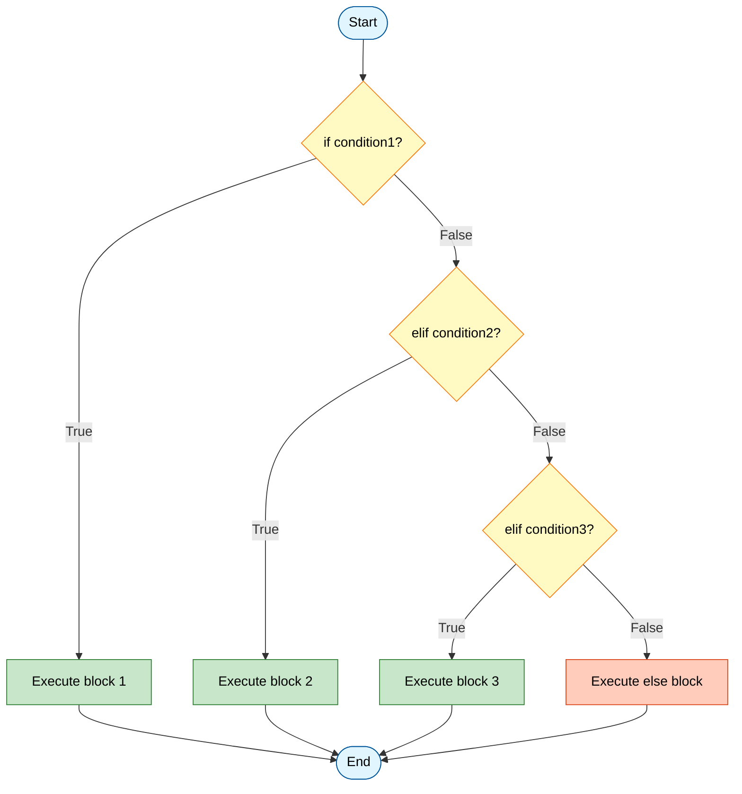
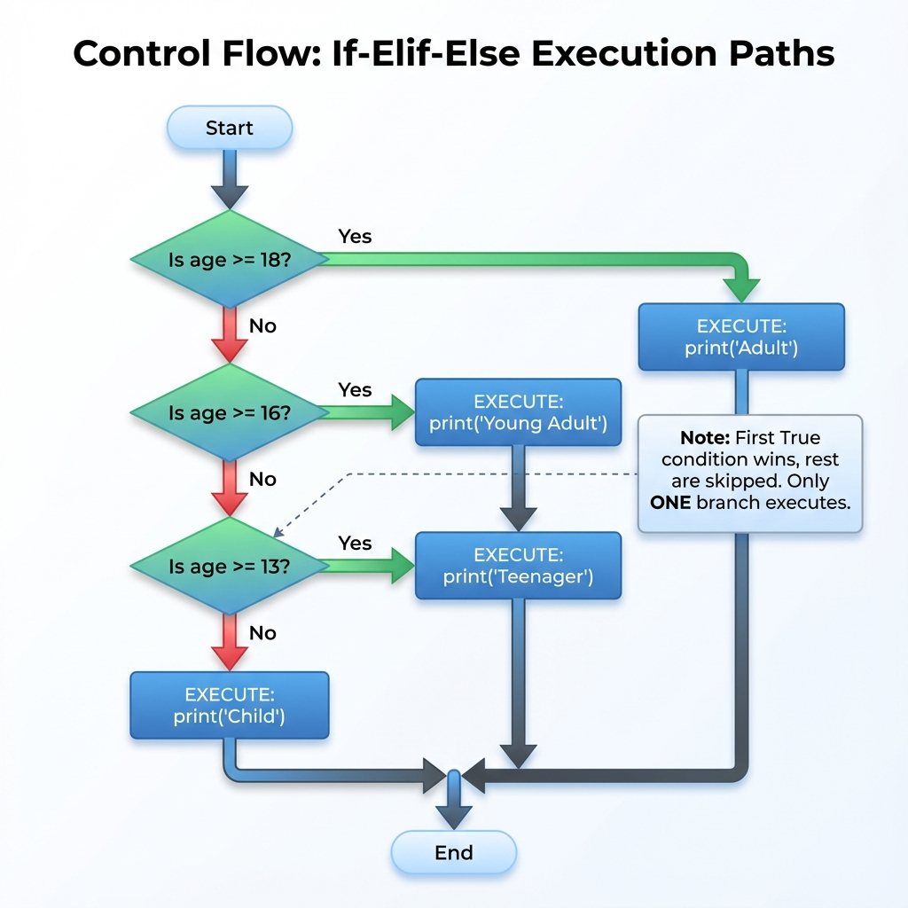
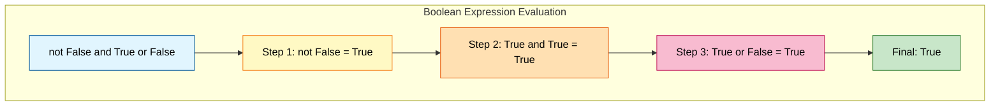
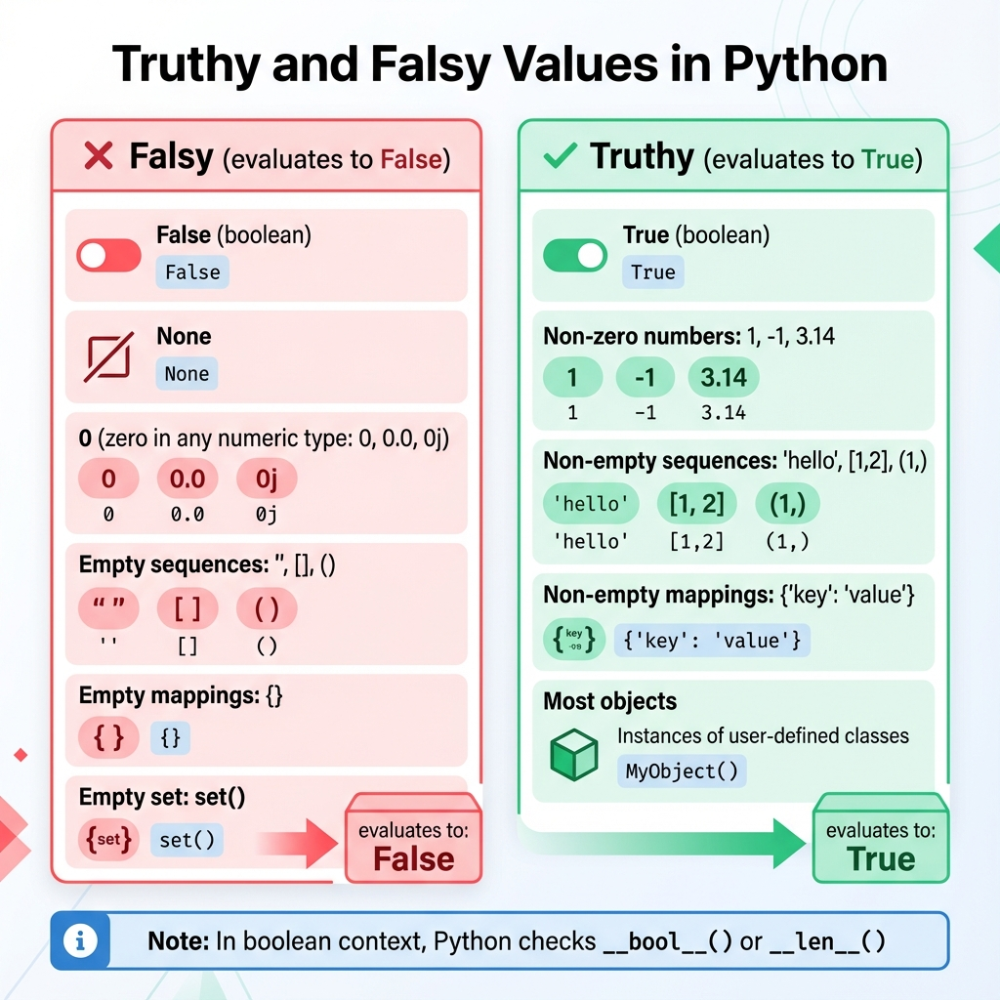
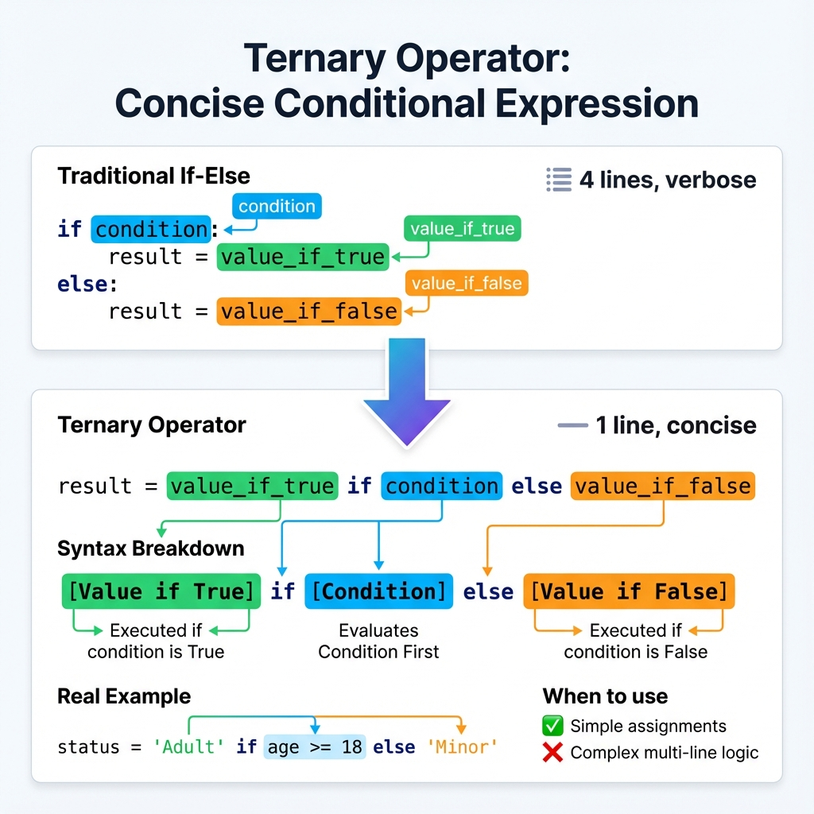
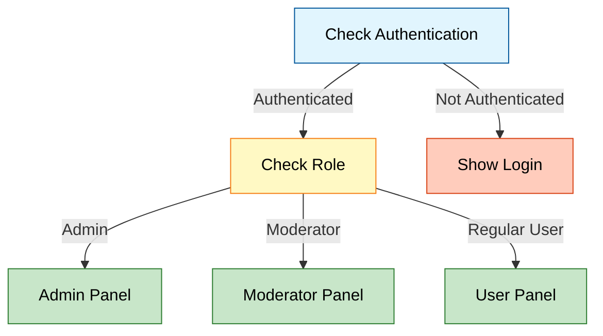

# Conditional Statements

## 1. Topic Definition

**Conditional statements** are control flow structures that allow a program to execute different code blocks based on the evaluation of **boolean expressions**. Using `if`, `elif`, and `else` keywords, Python can branch execution paths, enabling programs to make decisions and respond dynamically to different inputs, states, or conditions.

### Key Characteristics:
- **Branching logic**: Choose between multiple execution paths
- **Boolean evaluation**: Conditions evaluate to `True` or `False`
- **Sequential checking**: Conditions are evaluated in order, top to bottom
- **Exclusive execution**: Only the first matching condition's block executes
- **Indentation-based**: Python uses indentation (4 spaces) to define code blocks

## 2. Why Conditional Statements Exist

Conditional statements are fundamental to programming because they enable:
- **Decision-making**: Programs can react differently based on input or state
- **Validation**: Check if data meets requirements before processing
- **Error handling**: Detect and respond to exceptional conditions
- **Business logic**: Implement rules and workflows (discounts, permissions, etc.)
- **Flow control**: Direct program execution based on runtime conditions
- **User interaction**: Respond appropriately to different user choices

Without conditionals, programs would only execute linearly, unable to adapt to different scenarios.

## 3. Real-World Usage

Conditional statements are everywhere in real-world applications:
- **Authentication and authorization**: Checking credentials and permissions
- **Form validation**: Ensuring user input meets requirements (email format, password strength)
- **Feature flags and A/B testing**: Enabling/disabling features for different users
- **Business rules**: Applying discounts, calculating shipping, determining eligibility
- **Error handling**: Detecting invalid states and providing appropriate responses
- **State machines**: Managing application states (idle, loading, error, success)
- **Data processing**: Filtering, transforming, and routing data based on conditions
- **Game logic**: Character actions, collision detection, win/loss conditions

## 4. Key Rules & Syntax

```python
if condition:
    # Executes if condition is True
    statement1
elif other_condition:
    # Executes if first is False and this is True
    statement2
else:
    # Executes if all above conditions are False
    statement3
```

### Syntax Rules:
- **Indentation is mandatory**: Use 4 spaces (not tabs) to define code blocks
- **Colon required**: Every `if`, `elif`, and `else` must end with `:`
- **Boolean context**: Conditions are evaluated in a boolean context
- **elif is optional**: Can have zero or more `elif` branches
- **else is optional**: The `else` block is a catch-all for when all conditions are False
- **One branch executes**: Only the first `True` condition's block runs





## 5. Comparison Operators

Comparison operators produce boolean values (`True` or `False`):

| Operator | Meaning | Example | Result |
|----------|---------|---------|--------|
| `==` | Equal to | `5 == 5` | `True` |
| `!=` | Not equal to | `5 != 3` | `True` |
| `<` | Less than | `3 < 5` | `True` |
| `>` | Greater than | `5 > 3` | `True` |
| `<=` | Less than or equal | `5 <= 5` | `True` |
| `>=` | Greater than or equal | `5 >= 3` | `True` |
| `is` | Identity (same object) | `x is None` | True if x is None |
| `is not` | Not identity | `x is not None` | True if x is not None |
| `in` | Membership | `'a' in 'cat'` | `True` |
| `not in` | Not membership | `'x' not in 'cat'` | `True` |

### Important Distinctions:

**`==` vs `is`:**
- `==` checks **value equality** (are the contents the same?)
- `is` checks **identity** (are they the same object in memory?)

```python
a = [1, 2, 3]
b = [1, 2, 3]
c = a

a == b  # True (same values)
a is b  # False (different objects)
a is c  # True (same object)
```

**Chained comparisons:**
```python
x = 5
1 < x < 10      # True (equivalent to: 1 < x and x < 10)
a == b == c     # True if all three are equal
```

## 6. Boolean Logic Deep Dive

### Logical Operators:

| Operator | Description | Example | Result |
|----------|-------------|---------|--------|
| `and` | True if both are True | `True and True` | `True` |
| `or` | True if at least one is True | `True or False` | `True` |
| `not` | Inverts boolean value | `not True` | `False` |

### Truth Tables:

**AND operator:**
| A | B | A and B |
|---|---|---------|
| True | True | **True** |
| True | False | False |
| False | True | False |
| False | False | False |

**OR operator:**
| A | B | A or B |
|---|---|--------|
| True | True | **True** |
| True | False | **True** |
| False | True | **True** |
| False | False | False |

### Operator Precedence:
1. `not` (highest)
2. `and`
3. `or` (lowest)

```python
# Example showing precedence
result = not False and True or False
# Evaluates as: ((not False) and True) or False
# = (True and True) or False
# = True or False
# = True
```



## 7. Truthy and Falsy Values

In Python, **any value** can be evaluated in a boolean context. Values that evaluate to `False` are called **falsy**, and everything else is **truthy**.

### Falsy Values (evaluate to `False`):
- `False` (the boolean)
- `None`
- `0` (zero in any numeric type: `0`, `0.0`, `0j`)
- Empty sequences: `''`, `[]`, `()`
- Empty mappings: `{}`
- Empty set: `set()`

### Truthy Values (evaluate to `True`):
- `True` (the boolean)
- Non-zero numbers: `1`, `-1`, `3.14`, `complex(1, 1)`
- Non-empty sequences: `'hello'`, `[1, 2]`, `(1,)`
- Non-empty mappings: `{'key': 'value'}`
- Most objects (unless they define `__bool__()` or `__len__()` to return False/0)



**Practical example:**
```python
user_input = input("Enter name: ")
if user_input:  # Truthy if non-empty string
    print(f"Hello, {user_input}!")
else:
    print("No name provided")
```

## 8. Short-Circuit Evaluation

Python uses **short-circuit evaluation** for `and` and `or` operators, meaning it stops evaluating as soon as the result is determined.

### How it works:

**`and` operator:**
- If the first operand is `False`, immediately return `False` (don't evaluate second)
- If the first operand is `True`, evaluate and return the second operand

**`or` operator:**
- If the first operand is `True`, immediately return `True` (don't evaluate second)
- If the first operand is `False`, evaluate and return the second operand


**Performance benefits:**
```python
# Expensive function won't be called if user is None
if user and user.has_permission():
    grant_access()

# Default value pattern using 'or'
name = user_input or "Guest"  # Use "Guest" if user_input is empty
```

**Return values:**
Short-circuit operators return the last evaluated value, not necessarily `True`/`False`:
```python
result = 0 or 5 or 10    # Returns 5 (first truthy value)
result = "a" and "b"     # Returns "b" (last value if all truthy)
result = "" or None or 0 # Returns 0 (last value if all falsy)
```

## 9. Ternary Operator (Conditional Expression)

Python's **ternary operator** provides a concise way to write simple if-else statements in a single line.

**Syntax:**
```python
value_if_true if condition else value_if_false
```

**Examples:**
```python
# Traditional if-else
if age >= 18:
    status = "Adult"
else:
    status = "Minor"

# Ternary operator (one line)
status = "Adult" if age >= 18 else "Minor"

# More examples
max_value = a if a > b else b
message = "Even" if num % 2 == 0 else "Odd"
price = amount * 0.9 if has_discount else amount
```



**When to use:**
- ✅ Simple value assignments based on a condition
- ✅ Inline default values
- ✅ List comprehensions with conditions

**When to avoid:**
- ❌ Complex multi-line logic
- ❌ Nested ternary operators (hard to read)
- ❌ Side effects or multiple statements

## 10. Nested Conditionals

Conditionals can be nested within other conditionals for complex decision trees:

```python
if user_authenticated:
    if user.is_admin:
        show_admin_panel()
    elif user.is_moderator:
        show_moderator_panel()
    else:
        show_user_panel()
else:
    show_login_page()
```



**Best practices:**
- **Limit nesting depth**: More than 2-3 levels becomes hard to read
- **Use early returns**: Exit functions early instead of deep nesting
- **Extract to functions**: Break complex conditions into smaller, named functions
- **Consider refactoring**: Use dictionaries, polymorphism, or strategy patterns

## 11. Common Patterns

### Pattern 1: Guard Clauses (Early Returns)
```python
def process_order(order):
    # Check preconditions first, return early if invalid
    if not order:
        return "No order provided"
    
    if order.total < 0:
        return "Invalid order total"
    
    if not order.items:
        return "No items in order"
    
    # Main logic only runs if all guards pass
    return process_payment(order)
```

### Pattern 2: Default Values with `or`
```python
# Use default if value is falsy
username = input("Name: ") or "Guest"
config = load_config() or default_config
items = user_items or []
```

### Pattern 3: None Checking
```python
# Check for None explicitly (since 0, [], etc. are valid)
if user is None:
    user = create_default_user()

# Safe attribute access
if user is not None and user.is_active:
    log_activity(user)
```

### Pattern 4: Range Checking
```python
# Chained comparison
if 0 <= score <= 100:
    print("Valid score")

# Age categorization
if age < 13:
    category = "Child"
elif age < 20:
    category = "Teenager"
elif age < 65:
    category = "Adult"
else:
    category = "Senior"
```

### Pattern 5: Dictionary-Based Dispatch (Switch Alternative)
```python
# Instead of long if-elif chains
def handle_command(cmd):
    actions = {
        'start': start_service,
        'stop': stop_service,
        'restart': restart_service,
        'status': check_status
    }
    
    handler = actions.get(cmd, lambda: "Unknown command")
    return handler()
```

### Pattern 6: Validation with Multiple Conditions
```python
def is_valid_password(pwd):
    return (
        len(pwd) >= 8 and
        any(c.isupper() for c in pwd) and
        any(c.islower() for c in pwd) and
        any(c.isdigit() for c in pwd)
    )
```

## 12. Step-by-Step Explanation of Examples

See **examples.py** for detailed code demonstrations of:
- Login simulation with multiple conditions
- Temperature advice with cascading if-elif
- Simple calculator using conditional logic

## 13. Chapter Layout

Standard structure with:
- **syntax.py** - Basic syntax examples
- **examples.py** - Real-world usage patterns
- **exercises.py** - Practice problems
- **solutions.py** - Exercise solutions
- **mistakes.py** - Common errors and pitfalls
- **summary.md** - Quick reference guide
