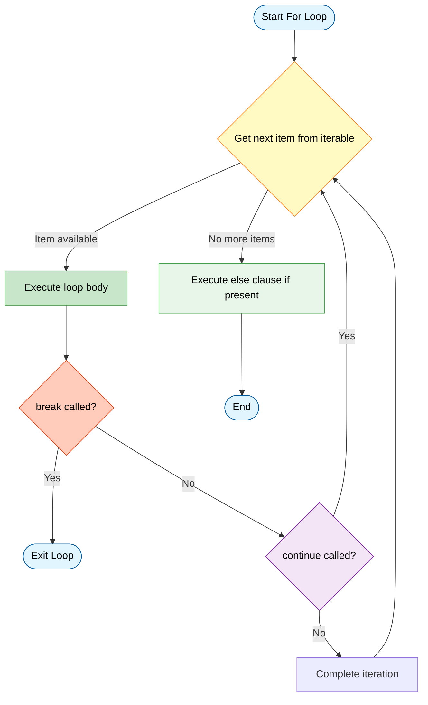
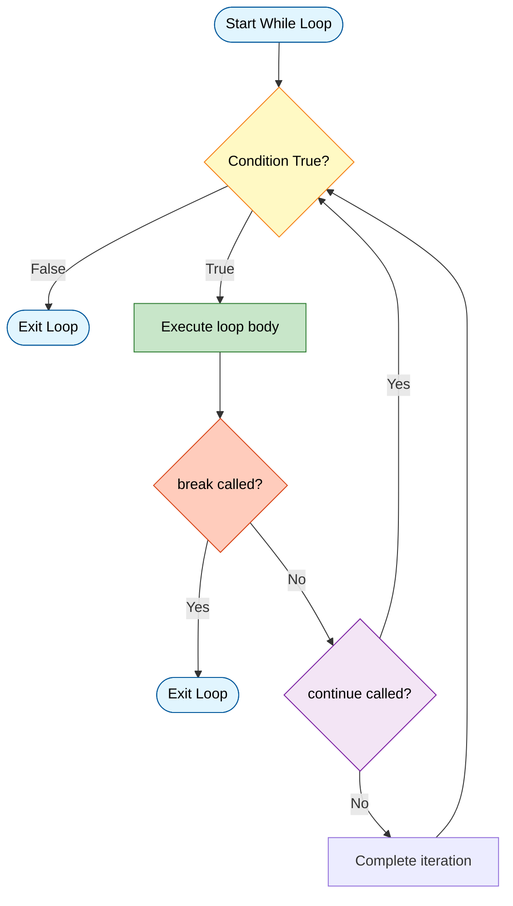
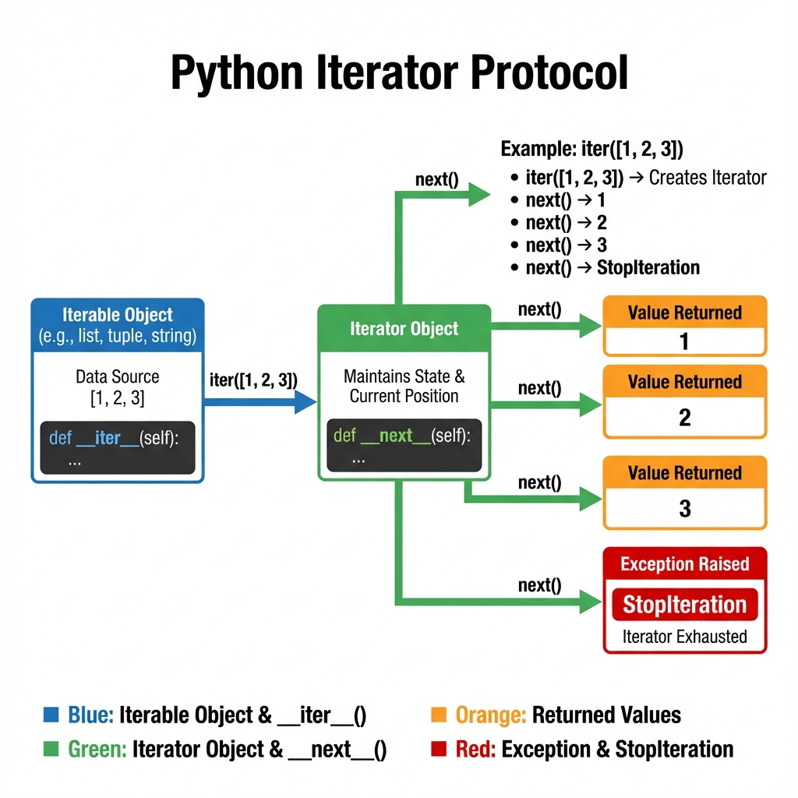
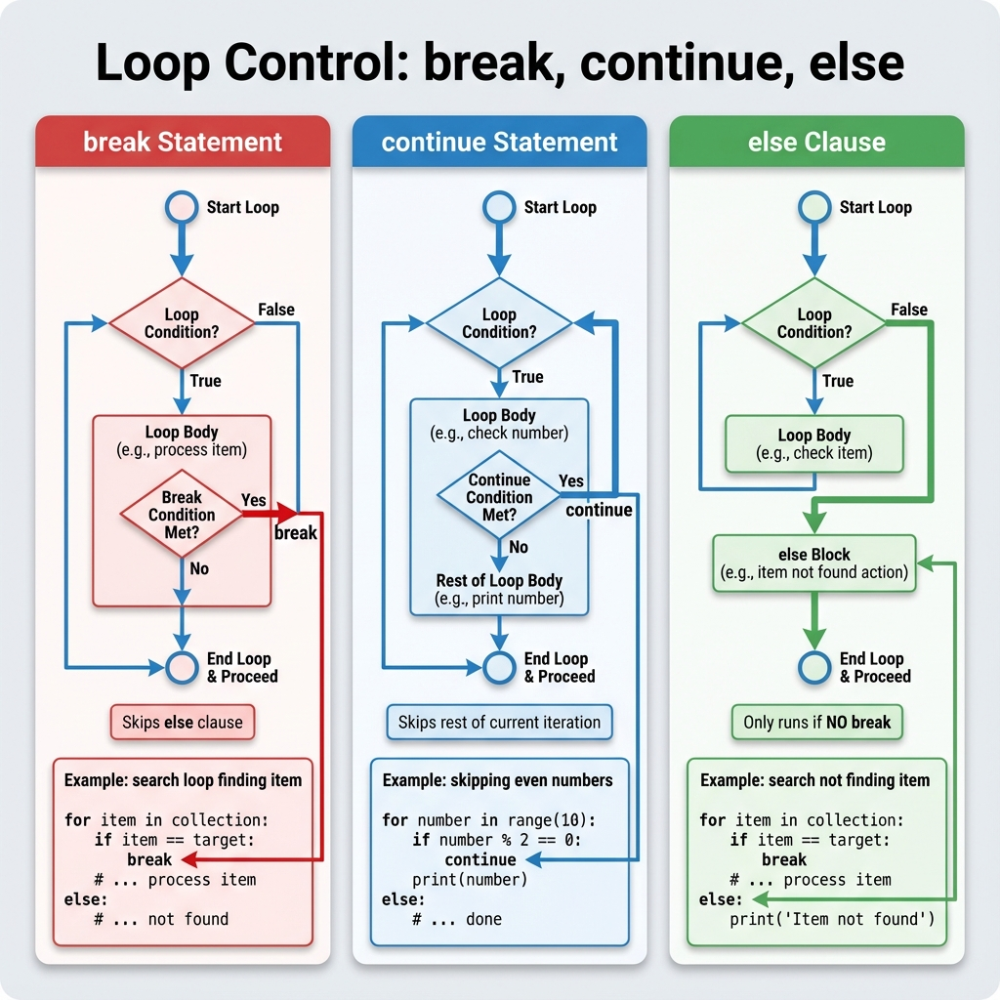
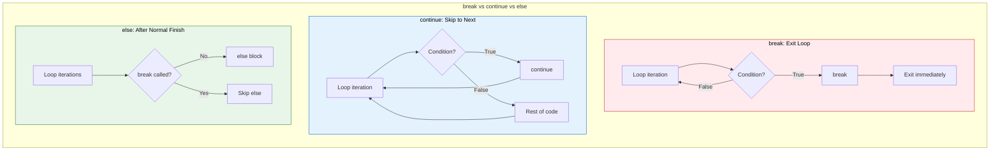
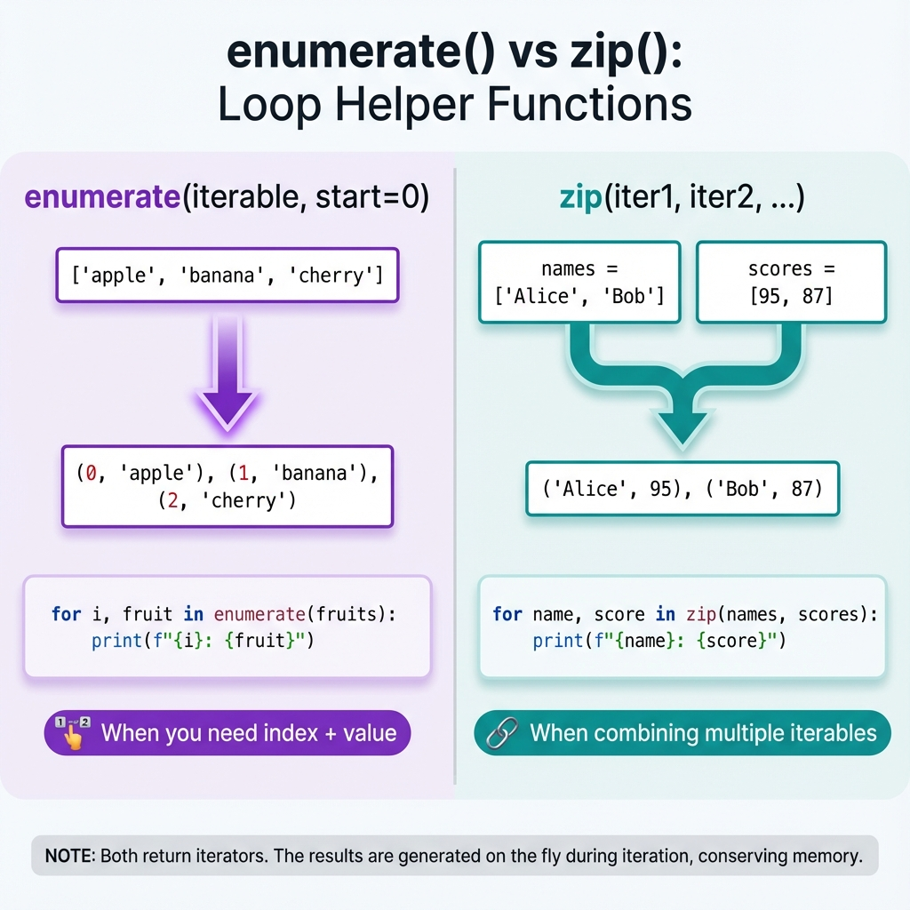
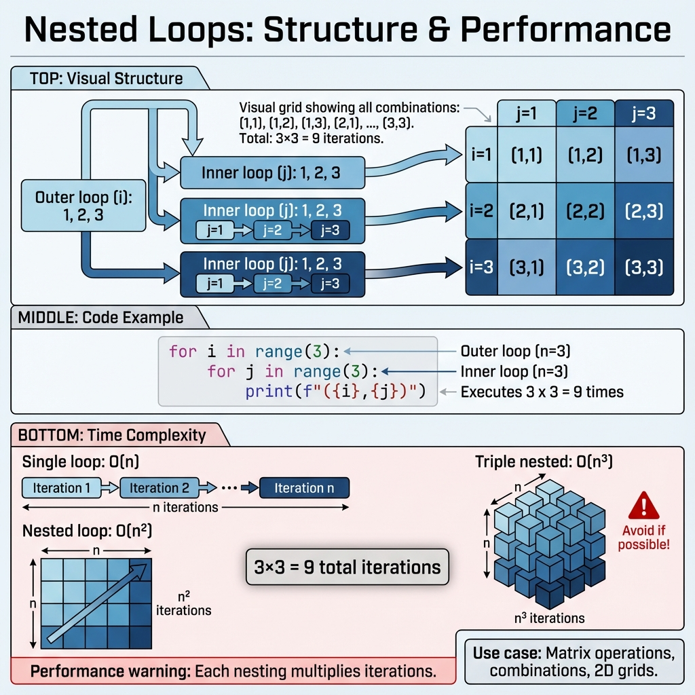

# Loops

## 1. Topic Definition

**Loops** are control flow structures that allow you to repeat a block of code multiple times. Python provides two primary loop types: **`for` loops** for iterating over sequences and **`while` loops** for repeating based on conditions. Loops are fundamental for processing collections, automating repetitive tasks, and implementing algorithms that require iteration.

### Key Characteristics:
- **Iteration**: Execute code repeatedly for each item in a collection or until a condition is met
- **Two types**: `for` (definite iteration) and `while` (indefinite iteration)
- **Loop control**: `break`, `continue`, and `else` provide fine-grained control
- **Iterator protocol**: Python's for loops work with any iterable object
- **Efficiency**: Built-in loop constructs are optimized in CPython

## 2. Why Loops Exist

Loops solve fundamental programming challenges:
- **Iterate over collections**: Process each element in lists, files, databases
- **Avoid code duplication**: Write once, execute many times
- **Repeat until condition**: Retry operations, wait for events, accumulate results
- **Transform data**: Map, filter, and reduce operations on collections
- **Algorithm implementation**: Searching, sorting, graph traversal all require loops
- **Automation**: Batch processing, report generation, data migration

Without loops, you'd need to write duplicate code for each item or operation, making programs unmaintainable.

## 3. Real-World Usage

Loops are ubiquitous in real-world applications:
- **Data processing**: Reading files line-by-line, processing CSV/JSON data
- **Web scraping**: Iterating through web pages, extracting data
- **Retry mechanisms**: Attempting network requests until success
- **UI rendering**: Displaying lists of items (products, messages, users)
- **Batch operations**: Sending emails, resizing images, updating records
- **Game loops**: Main game loop processing events and rendering frames
- **Data validation**: Checking each item in a collection for compliance
- **Aggregation**: Calculating sums, averages, finding min/max values

## 4. Key Rules & Syntax

### For Loop
Used for iterating over **sequences** (lists, strings, ranges, etc.):

```python
for item in iterable:
    # code block executes for each item
    process(item)
```

### While Loop
Used for repeating based on a **condition**:

```python
while condition:
    # code block executes while condition is True
    do_something()
    # Must update condition to avoid infinite loop!
```

### Loop Control Statements

| Statement | Purpose | Example |
|-----------|---------|---------|
| `break` | Exit loop immediately | `if found: break` |
| `continue` | Skip to next iteration | `if invalid: continue` |
| `else` | Runs if loop completes without `break` | `for...else:` |
| `pass` | Placeholder (do nothing) | `for x in range(10): pass` |





## 5. Iterator Protocol Deep Dive

Python's `for` loop works with **iterables** — objects that implement the iterator protocol.

### How It Works:

1. **Iterable**: An object with an `__iter__()` method that returns an iterator
2. **Iterator**: An object with a `__next__()` method that returns the next value
3. **StopIteration**: Exception raised when no more items are available

```python
# What happens under the hood
numbers = [1, 2, 3]
iterator = iter(numbers)  # Calls numbers.__iter__()

print(next(iterator))  # Calls iterator.__next__() → 1
print(next(iterator))  # → 2
print(next(iterator))  # → 3
print(next(iterator))  # → Raises StopIteration
```

**For loop equivalent:**
```python
# This for loop...
for num in [1, 2, 3]:
    print(num)

# ...is essentially this:
_iter = iter([1, 2, 3])
while True:
    try:
        num = next(_iter)
        print(num)
    except StopIteration:
        break
```



### Common Iterables:
- **Sequences**: `list`, `tuple`, `str`, `bytes`, `range`
- **Collections**: `set`, `dict`, `frozenset`
- **Files**: File objects are iterators (iterate line-by-line)
- **Generators**: Functions using `yield`
- **Custom objects**: Any class implementing `__iter__()`

## 6. Loop Control: break, continue, else

### Break Statement
Immediately exits the loop, skipping any remaining iterations and the `else` clause:

```python
for i in range(10):
    if i == 5:
        break  # Exit when i is 5
    print(i)  # Prints 0, 1, 2, 3, 4
```

### Continue Statement
Skips the rest of the current iteration and jumps to the next:

```python
for i in range(5):
    if i == 2:
        continue  # Skip when i is 2
    print(i)  # Prints 0, 1, 3, 4 (skips 2)
```

### Else Clause
The `else` block executes **only if** the loop completes normally (without `break`):

```python
# Search pattern
for item in collection:
    if item == target:
        print("Found!")
        break
else:
    print("Not found")  # Only runs if break never executed
```





## 7. Built-in Loop Functions

### range(start, stop, step)
Generates a sequence of numbers:

```python
range(5)        # 0, 1, 2, 3, 4
range(2, 8)     # 2, 3, 4, 5, 6, 7
range(0, 10, 2) # 0, 2, 4, 6, 8
range(5, 0, -1) # 5, 4, 3, 2, 1
```

**Note**: `range()` is memory-efficient; it doesn't create a list, it generates values on-demand.

### enumerate(iterable, start=0)
Returns index and value pairs:

```python
fruits = ['apple', 'banana', 'cherry']
for index, fruit in enumerate(fruits):
    print(f"{index}: {fruit}")
# 0: apple
# 1: banana
# 2: cherry

# Custom start index
for i, fruit in enumerate(fruits, start=1):
    print(f"{i}. {fruit}")
# 1. apple
# 2. banana
# 3. cherry
```

### zip(*iterables)
Combines multiple iterables element-wise:

```python
names = ['Alice', 'Bob', 'Charlie']
scores = [95, 87, 92]
grades = ['A', 'B', 'A']

for name, score, grade in zip(names, scores, grades):
    print(f"{name}: {score} ({grade})")
# Alice: 95 (A)
# Bob: 87 (B)
# Charlie: 92 (A)
```

**Note**: `zip()` stops at the shortest iterable.



## 8. Nested Loops

Loops can be nested inside other loops for multi-dimensional iteration:

```python
# Multiplication table
for i in range(1, 4):
    for j in range(1, 4):
        print(f"{i} × {j} = {i*j:2}", end="  ")
    print()  # New line after each row

# Output:
# 1 × 1 =  1  1 × 2 =  2  1 × 3 =  3
# 2 × 1 =  2  2 × 2 =  4  2 × 3 =  6
# 3 × 1 =  3  3 × 2 =  6  3 × 3 =  9
```

### Performance Considerations:

**Time Complexity:**
- Single loop: **O(n)** — executes n times
- Nested loop (2 levels): **O(n²)** — executes n × n times
- Triple nested: **O(n³)** — executes n × n × n times



### When to Use Nested Loops:
- ✅ Matrix operations (2D arrays)
- ✅ Generating combinations or permutations
- ✅ Comparing all pairs in a collection
- ✅ Multi-dimensional data structures (grids, tables)

### When to Avoid:
- ❌ Large datasets (performance degrades quickly)
- ❌ If a single-pass algorithm exists
- ❌ Consider alternatives: list comprehensions, vectorized operations (NumPy)

## 9. Common Loop Patterns

### Pattern 1: Accumulator Pattern
Building a result by accumulating values:

```python
# Sum all numbers
total = 0
for num in range(1, 101):
    total += num
print(total)  # 5050

# Build a list
evens = []
for num in range(10):
    if num % 2 == 0:
        evens.append(num)
```

### Pattern 2: Search Pattern with break/else
Finding an item in a collection:

```python
def find_user(users, target_id):
    for user in users:
        if user['id'] == target_id:
            return user
    return None  # Not found

# Or with else:
for user in users:
    if user['id'] == target_id:
        print(f"Found: {user}")
        break
else:
    print("User not found")
```

### Pattern 3: Filtering Pattern
Selecting items based on criteria:

```python
# Filter positive numbers
numbers = [-2, 3, -1, 5, 0, -7, 8]
positives = []
for num in numbers:
    if num > 0:
        positives.append(num)

# Better: list comprehension
positives = [num for num in numbers if num > 0]
```

### Pattern 4: Transformation Pattern
Converting items from one form to another:

```python
# Convert to uppercase
names = ['alice', 'bob', 'charlie']
uppercase_names = []
for name in names:
    uppercase_names.append(name.upper())

# Better: list comprehension
uppercase_names = [name.upper() for name in names]
```

### Pattern 5: Enumerate for Index Access
When you need both index and value:

```python
# Find index of first negative number
numbers = [1, 5, -3, 7, -2]
for index, num in enumerate(numbers):
    if num < 0:
        print(f"First negative at index {index}: {num}")
        break
```

### Pattern 6: Zip for Parallel Iteration
Processing multiple lists together:

```python
# Calculate total cost
prices = [10.99, 5.99, 15.49]
quantities = [2, 3, 1]

total = 0
for price, qty in zip(prices, quantities):
    total += price * qty
print(f"Total: ${total:.2f}")
```

### Pattern 7: Counter Pattern
Counting occurrences:

```python
# Count vowels
text = "Hello World"
vowel_count = 0
for char in text.lower():
    if char in 'aeiou':
        vowel_count += 1
```

### Pattern 8: Early Exit with Sentinel Value
Stop when a specific value is found:

```python
# Read until empty line
while True:
    line = input("Enter text (empty to quit): ")
    if not line:  # Empty string is falsy
        break
    process(line)
```

## 10. While Loops and Infinite Loops

### While Loop Best Practices:

```python
# Good: Clear termination condition
count = 0
while count < 5:
    print(count)
    count += 1  # MUST update count!

# Common pattern: User input validation
while True:
    age = input("Enter age: ")
    if age.isdigit() and int(age) > 0:
        break
    print("Invalid age, try again")
```

### Preventing Infinite Loops:
```python
# ❌ Infinite loop (count never changes)
count = 0
while count < 5:
    print(count)
    # Missing: count += 1

# ✅ Correct
count = 0
while count < 5:
    print(count)
    count += 1  # Ensures termination
```

## 11. List Comprehensions (Alternative to Loops)

For simple transformations and filtering, list comprehensions are more concise:

```python
# Traditional loop
squares = []
for x in range(10):
    squares.append(x ** 2)

# List comprehension (preferred)
squares = [x ** 2 for x in range(10)]

# With condition
evens = [x for x in range(10) if x % 2 == 0]

# Nested comprehension (use sparingly)
matrix = [[i*j for j in range(3)] for i in range(3)]
```

**When to use comprehensions:**
- ✅ Simple transformations
- ✅ Filtering with simple conditions
- ✅ One-liners that remain readable

**When to use traditional loops:**
- ✅ Complex logic in the loop body
- ✅ Multiple operations per iteration
- ✅ Better readability for complex cases

## 12. Step-by-Step Explanation of Examples

See **examples.py** for detailed code demonstrations of:
- Summing numbers with accumulator pattern
- Iterating lists
- Using break/else for search
- Nested loops for multiplication table

## 13. Chapter Layout

Standard structure with:
- **syntax.py** - Basic syntax examples
- **examples.py** - Real-world usage patterns
- **exercises.py** - Practice problems
- **solutions.py** - Exercise solutions
- **mistakes.py** - Common errors and pitfalls
- **summary.md** - Quick reference guide
