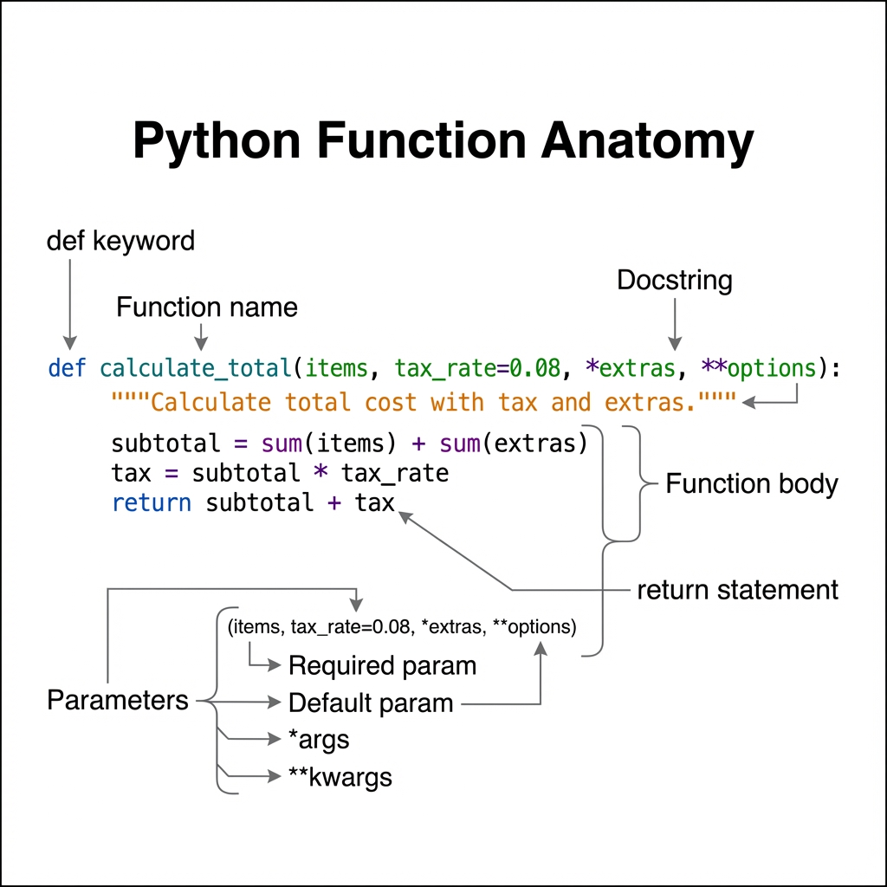
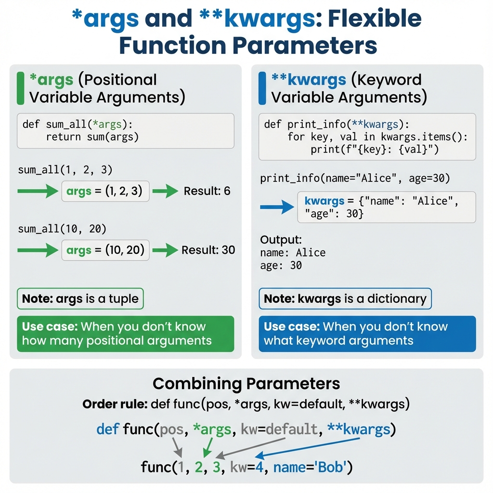
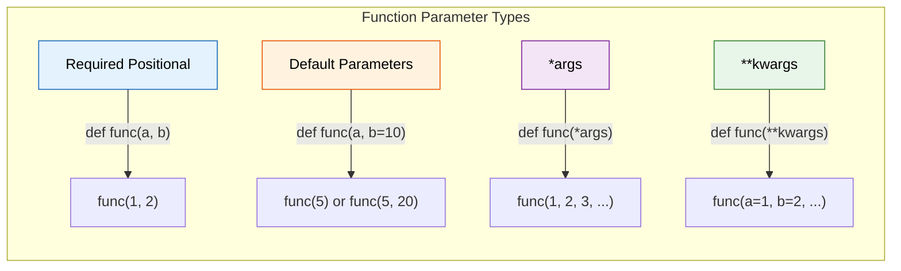
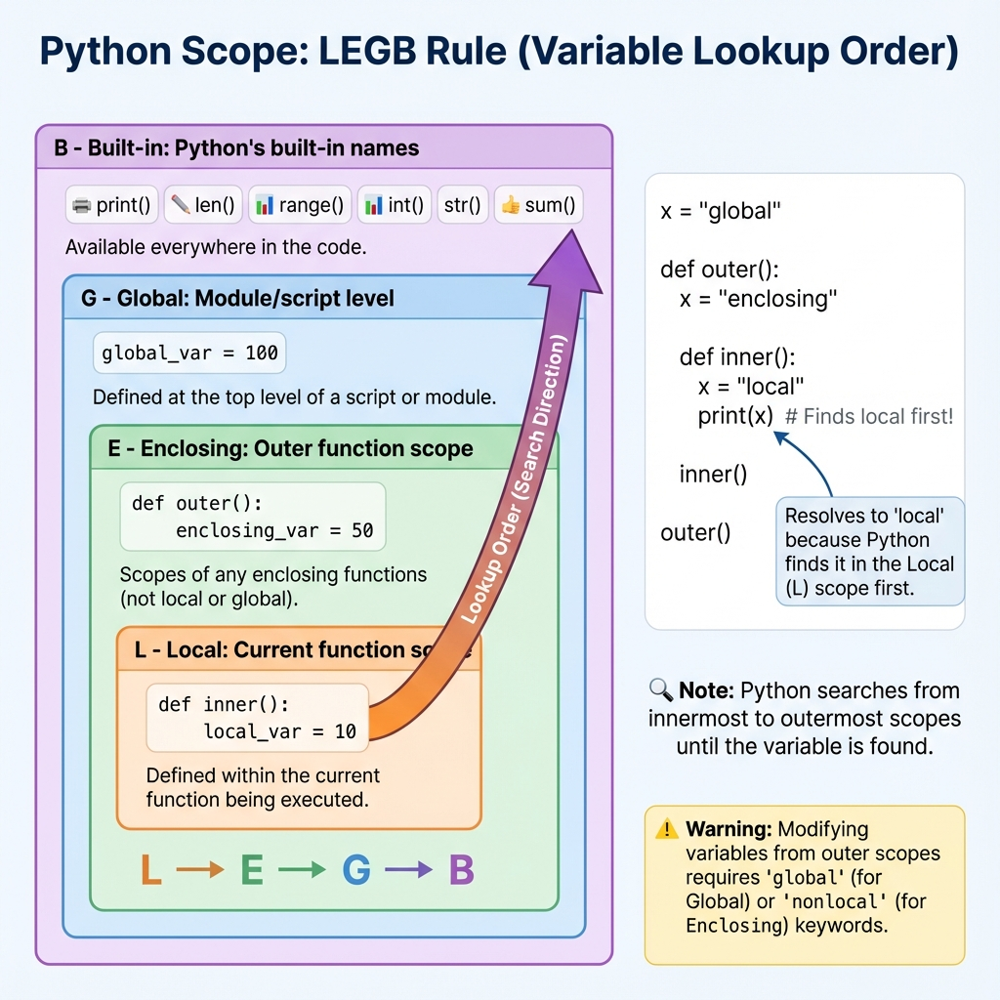
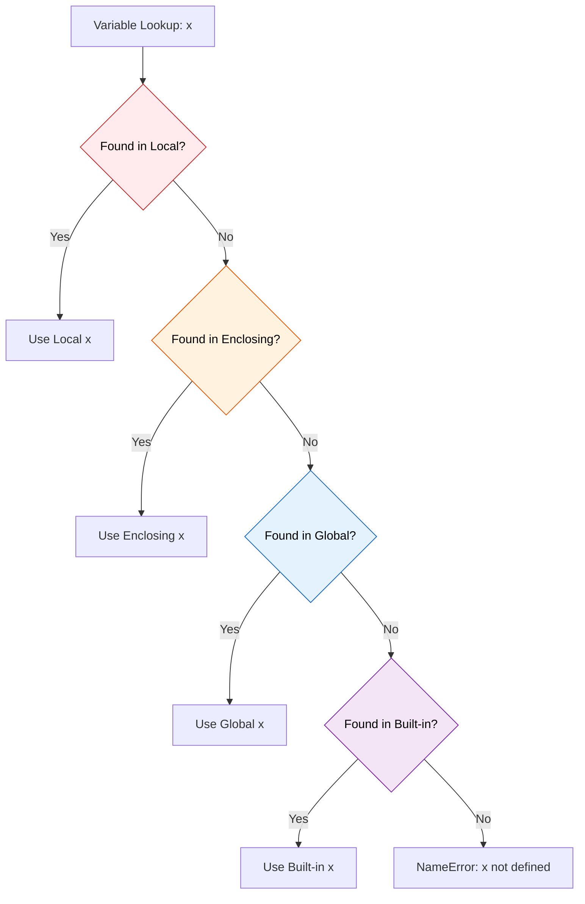
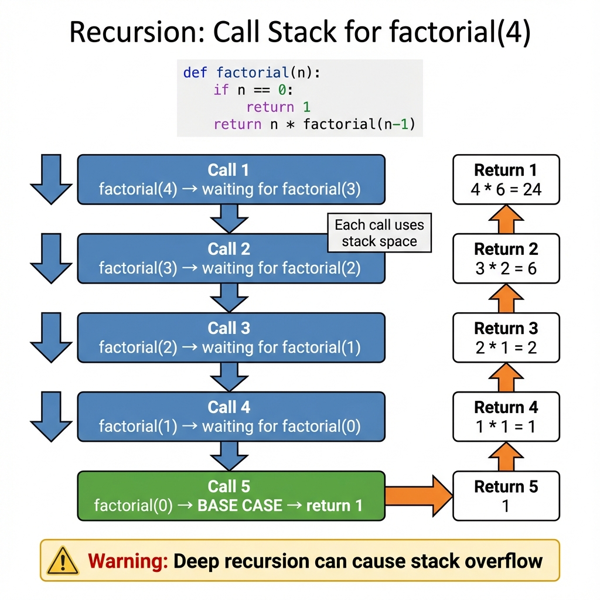
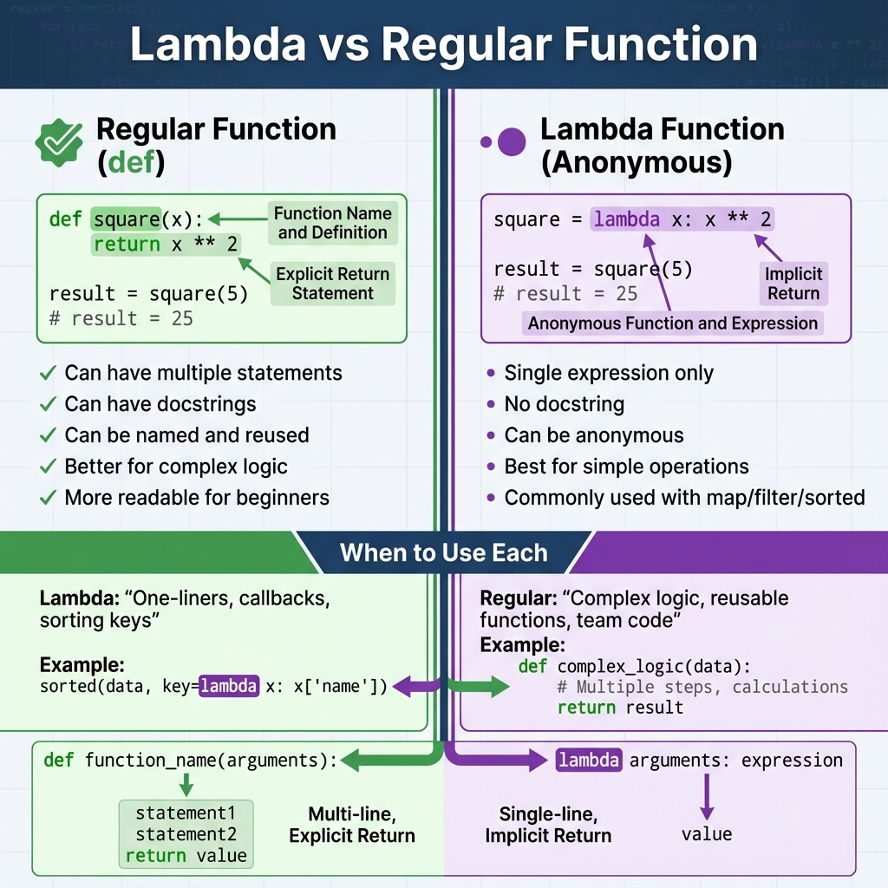
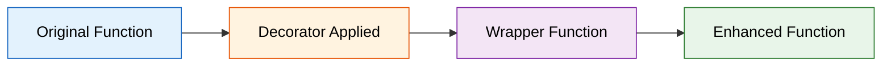

# Functions

## 1. Topic Definition

**Functions** are reusable blocks of code that perform specific tasks. They are fundamental building blocks in Python that enable code organization, reusability, and abstraction. Functions are **first-class objects** in Python, meaning they can be assigned to variables, passed as arguments, returned from other functions, and stored in data structures.

### Key Characteristics:
- **Def**ined with `def` keyword
- **Parameters**: Accept input values
- **Return values**: Output results (or `None` by default)
- **First-class objects**: Can be treated like any other value
- **Scope**: Have their own local namespace
- **Docstrings**: Self-documenting with triple quotes

## 2. Why Functions Exist

Functions solve fundamental programming challenges:
- **DRY (Don't Repeat Yourself)**: Write once, use many times
- **Modularity**: Break complex problems into manageable pieces
- **Abstraction**: Hide implementation details, expose clean interfaces
- **Testing**: Easier to test small, focused functions
- **Maintenance**: Changes made in one place
- **Readability**: Named functions make code self-documenting
- **Collaboration**: Team members can work on separate functions

## 3. Real-World Usage

Functions are everywhere in software development:
- **Data validation**: Email format checking, password strength validation
- **API handlers**: Route handlers in web frameworks (Flask, Django, FastAPI)
- **Utilities**: Date formatting, string manipulation, file operations
- **Calculations**: Financial computations, statistical analysis
- **Data transformation**: Parsing JSON, cleaning data, format conversion
- **Event handlers**: Button clicks, form submissions in GUIs
- **Middleware**: Authentication, logging, error handling
- **Algorithms**: Sorting, searching, graph traversal

## 4. Function Anatomy



### Basic Syntax:
```python
def function_name(parameter1, parameter2=default_value):
    """
    Docstring: Describe what the function does.
    
    Args:
        parameter1: Description of first parameter
        parameter2: Description of second parameter (default: default_value)
    
    Returns:
        Description of return value
    """
    # Function body
    result = parameter1 + parameter2
    return result
```

### Components Explained:
- **`def` keyword**: Declares a function
- **Function name**: Follows naming conventions (lowercase, underscores)
- **Parameters**: Input variables in parentheses
- **Docstring**: Triple-quoted string explaining the function
- **Function body**: Indented code block
- **`return` statement**: Sends value back to caller (optional)

## 5. Parameters and Arguments

### Types of Parameters:

| Type | Syntax | Description | Example |
|------|--------|-------------|---------|
| **Positional** | `def func(a, b)` | Required, order matters | `func(1, 2)` |
| **Keyword** | `func(a=1, b=2)` | Named arguments | `func(b=2, a=1)` |
| **Default** | `def func(a, b=10)` | Optional with default | `func(5)` → b=10 |
| ***args** | `def func(*args)` | Variable positional | `func(1, 2, 3)` |
| ****kwargs** | `def func(**kwargs)` | Variable keyword | `func(a=1, b=2)` |
| **Keyword-only** | `def func(*, kw)` | Must use keyword | `func(kw=5)` |

### Parameter Order Rule:
```python
def function(positional, *args, keyword=default, **kwargs):
    pass
```

**Order must be**: positional → *args → keyword-only → **kwargs



### *args Example:
```python
def sum_all(*numbers):
    """Sum any number of arguments."""
    return sum(numbers)

print(sum_all(1, 2, 3))        # 6
print(sum_all(10, 20, 30, 40)) # 100
# numbers is a tuple: (1, 2, 3)
```

### **kwargs Example:
```python
def print_info(**data):
    """Print key-value pairs."""
    for key, value in data.items():
        print(f"{key}: {value}")

print_info(name="Alice", age=30, city="NYC")
# data is a dict: {"name": "Alice", "age": 30, "city": "NYC"}
```



## 6. Return Values

Functions can return values using the `return` statement:

```python
def add(a, b):
    return a + b  # Returns sum

result = add(3, 5)  # result = 8
```

### Multiple Return Values:
```python
def divmod_custom(a, b):
    quotient = a // b
    remainder = a % b
    return quotient, remainder  # Returns tuple

q, r = divmod_custom(17, 5)  # q=3, r=2
```

### Early Return:
```python
def validate_age(age):
    if age < 0:
        return "Invalid age"  # Exit early
    if age < 18:
        return "Minor"
    return "Adult"
```

### No Return = None:
```python
def greet(name):
    print(f"Hello, {name}")
    # No return statement

result = greet("Alice")  # result = None
```

## 7. Scope and Namespaces (LEGB Rule)

Python uses the **LEGB** rule to resolve variable names:

- **L**ocal: Variables defined inside the current function
- **E**nclosing: Variables in outer (enclosing) functions
- **G**lobal: Variables defined at module level
- **B**uilt-in: Python's built-in names (print, len, etc.)



### Example:
```python
x = "global"  # Global scope

def outer():
    x = "enclosing"  # Enclosing scope
    
    def inner():
        x = "local"  # Local scope
        print(x)  # Prints "local" (L takes precedence)
    
    inner()
    print(x)  # Prints "enclosing"

outer()
print(x)  # Prints "global"
```

### Modifying Outer Scopes:
```python
count = 0  # Global

def increment():
    global count  # Declare global modification
    count += 1

increment()
print(count)  # 1
```

### Nonlocal (for enclosing scope):
```python
def outer():
    count = 0
    
    def inner():
        nonlocal count  # Modify enclosing scope
        count += 1
    
    inner()
    print(count)  # 1

outer()
```



## 8. Recursion

**Recursion** is when a function calls itself. Every recursive function needs:
1. **Base case**: Condition that stops recursion
2. **Recursive case**: Function calls itself with modified input



### Classic Example - Factorial:
```python
def factorial(n):
    # Base case
    if n == 0 or n == 1:
        return 1
    # Recursive case
    return n * factorial(n - 1)

print(factorial(5))  # 120 = 5 * 4 * 3 * 2 * 1
```

### When to Use Recursion:
- ✅ Tree/graph traversal
- ✅ Divide-and-conquer algorithms (quicksort, mergesort)
- ✅ Mathematical sequences (Fibonacci, factorial)
- ✅ Backtracking problems (maze solving, sudoku)

### When to Avoid:
- ❌ Simple iterations (use loops instead)
- ❌ Deep recursion (Python has recursion limit ~1000)
- ❌ Performance-critical code (recursion has overhead)

## 9. Lambda Functions

**Lambda functions** are small anonymous functions defined with `lambda` keyword:

**Syntax**: `lambda parameters: expression`



### Examples:
```python
# Lambda function
square = lambda x: x ** 2
print(square(5))  # 25

# Equivalent regular function
def square(x):
    return x ** 2
```

### Common Use Cases:

**1. Sorting with key:**
```python
students = [
    {"name": "Alice", "grade": 85},
    {"name": "Bob", "grade": 92},
    {"name": "Charlie", "grade": 78}
]

# Sort by grade
sorted_students = sorted(students, key=lambda s: s["grade"])
```

**2. Map, Filter, Reduce:**
```python
numbers = [1, 2, 3, 4, 5]

#  Map: apply function to each element
squared = list(map(lambda x: x**2, numbers))  # [1, 4, 9, 16, 25]

# Filter: keep elements where function returns True
evens = list(filter(lambda x: x % 2 == 0, numbers))  # [2, 4]
```

### Limitations:
- Single expression only (no statements)
- No docstrings
- Less readable for complex logic
- Harder to debug

## 10. Higher-Order Functions

**Higher-order functions** either:
- Take functions as arguments
- Return functions as results

### Example - Function as Argument:
```python
def apply_operation(func, x, y):
    """Apply any binary function."""
    return func(x, y)

result = apply_operation(lambda a, b: a + b, 5, 3)  # 8
result = apply_operation(lambda a, b: a * b, 5, 3)  # 15
```

### Example - Function as Return Value:
```python
def make_multiplier(n):
    """Factory function returning a multiplier."""
    def multiplier(x):
        return x * n
    return multiplier

times_two = make_multiplier(2)
times_five = make_multiplier(5)

print(times_two(10))   # 20
print(times_five(10))  # 50
```

## 11. Closures

A **closure** is a function that remembers values from its enclosing scope, even after that scope has finished executing.

```python
def make_counter():
    count = 0  # Enclosing scope variable
    
    def increment():
        nonlocal count
        count += 1
        return count
    
    return increment  # Returns the inner function

counter = make_counter()
print(counter())  # 1
print(counter())  # 2
print(counter())  # 3
# 'count' persists between calls!
```

## 12. Decorators

**Decorators** are functions that modify other functions. They use the `@decorator` syntax.

### Basic Decorator:
```python
def uppercase_decorator(func):
    """Decorator that uppercases function result."""
    def wrapper(*args, **kwargs):
        result = func(*args, **kwargs)
        return result.upper()
    return wrapper

@uppercase_decorator
def greet(name):
    return f"hello, {name}"

print(greet("alice"))  # "HELLO, ALICE"
```

### Decorator Flow:


### Common Use Cases:
- **Timing**: Measure execution time
- **Logging**: Log function calls
- **Authentication**: Check permissions
- **Caching**: Memoize results
- **Validation**: Check input types

## 13. Common Patterns

### Pattern 1: Factory Functions
```python
def create_person(name, age):
    """Factory function returning a dictionary."""
    return {
        "name": name,
        "age": age,
        "greet": lambda: f"Hi, I'm {name}"
    }

person = create_person("Alice", 30)
print(person["greet"]())  # "Hi, I'm Alice"
```

### Pattern 2: Callback Functions
```python
def process_data(data, callback):
    """Process data and call callback with result."""
    result = sum(data)
    callback(result)

process_data([1, 2, 3], lambda x: print(f"Sum: {x}"))
```

### Pattern 3: Memoization (Caching)
```python
def memoize(func):
    cache = {}
    def wrapper(n):
        if n not in cache:
            cache[n] = func(n)
        return cache[n]
    return wrapper

@memoize
def fibonacci(n):
    if n < 2:
        return n
    return fibonacci(n-1) + fibonacci(n-2)

print(fibonacci(100))  # Fast with caching!
```

## 14. Best Practices

### Do's:
- ✅ **Single Responsibility**: One function, one task
- ✅ **Descriptive Names**: `calculate_total()` not `calc()`
- ✅ **Docstrings**: Document parameters and return values
- ✅ **Keep it short**: Aim for < 20 lines
- ✅ **Pure functions**: Avoid side effects when possible
- ✅ **Type hints**: `def add(a: int, b: int) -> int:`

### Don'ts:
- ❌ Too many parameters (> 5)
- ❌ Modifying global state
- ❌ Deep nesting (max 2-3 levels)
- ❌ Unclear return types
- ❌ Missing error handling

## 15. Step-by-Step Explanation of Examples

See **examples.py** for detailed code demonstrations.

## 16. Chapter Layout

Standard structure with:
- **syntax.py** - Basic syntax examples
- **examples.py** - Real-world usage patterns
- **exercises.py** - Practice problems
- **solutions.py** - Exercise solutions
- **mistakes.py** - Common errors and pitfalls
- **summary.md** - Quick reference guide

## 17. References & Further Reading
- **Official Documentation**: [Python 3 Functions](https://docs.python.org/3/tutorial/controlflow.html#defining-functions) - The authoritative source.
- **Real Python**: [Defining Your Own Python Function](https://realpython.com/defining-your-own-python-function/) - Deep dive.
- **Real Python**: [*args and **kwargs in Python](https://realpython.com/python-kwargs-and-args/) - Mastering variable arguments.
- **GeeksforGeeks**: [Python Functions](https://www.geeksforgeeks.org/python-functions/) - Examples and types.
