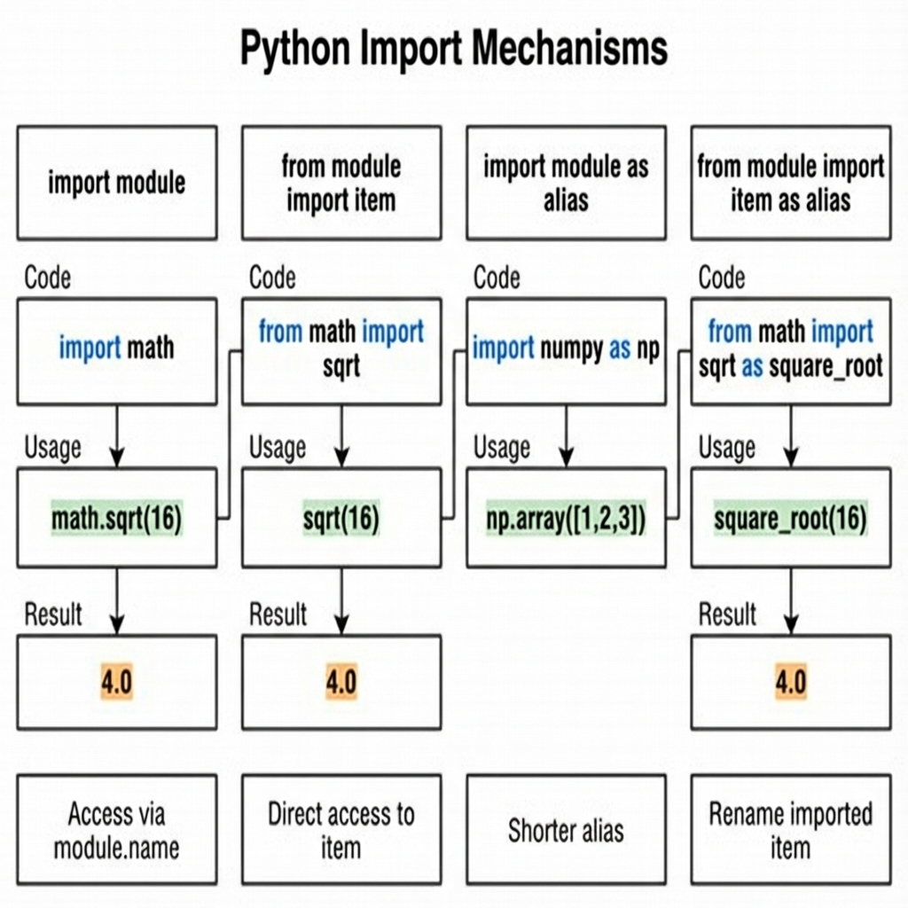
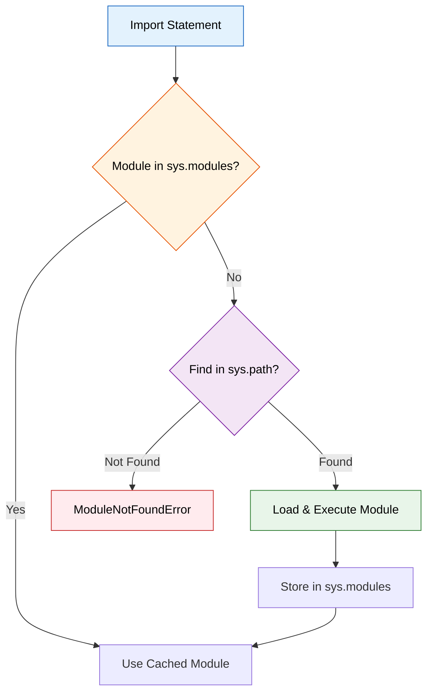
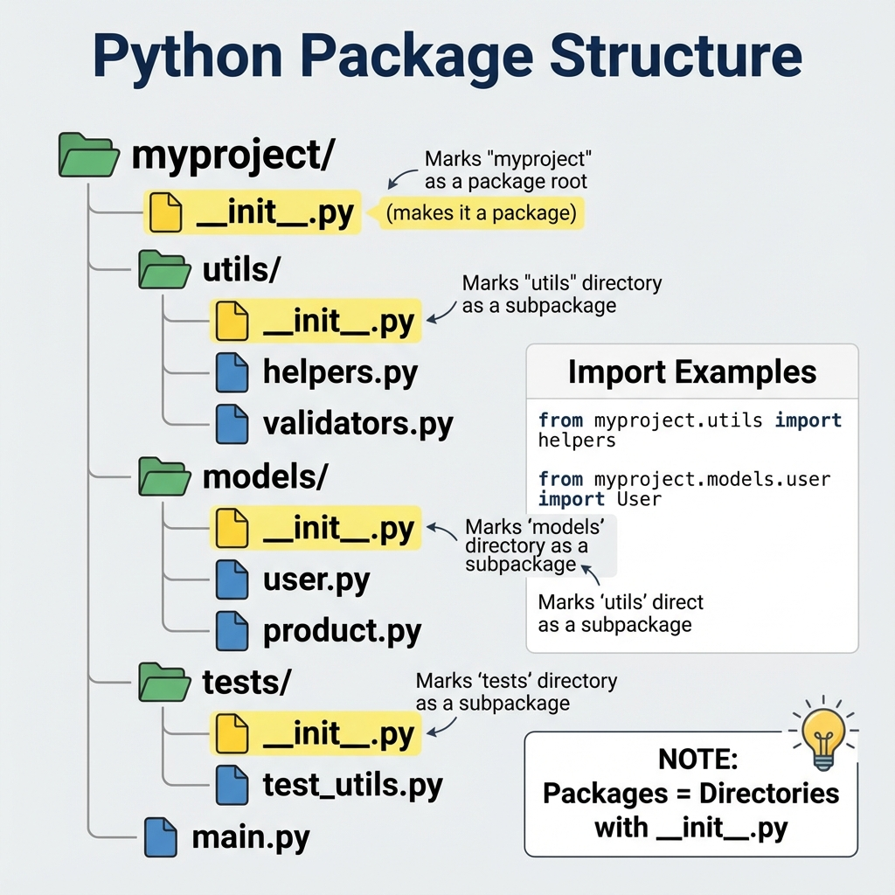
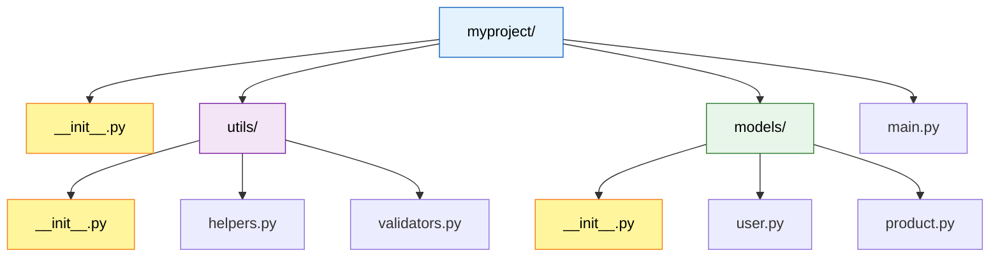
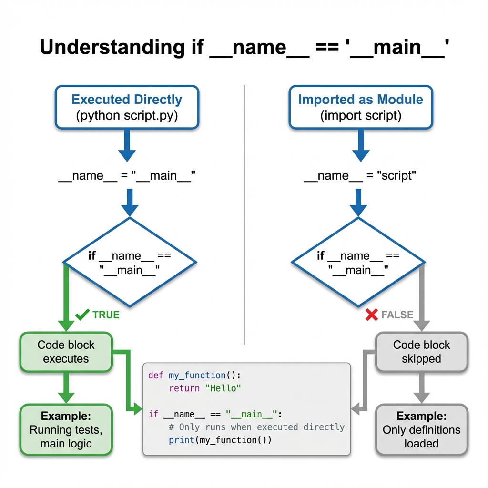
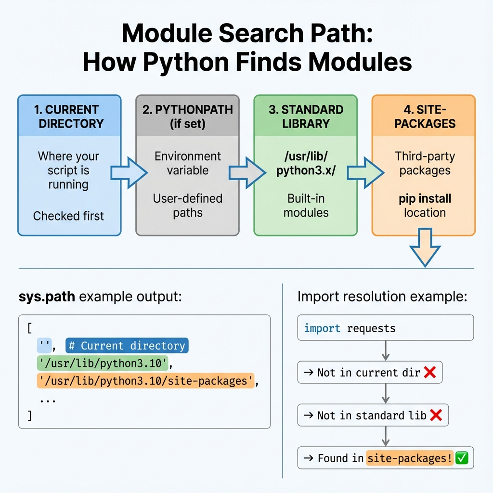

# Modules

## 1. Topic Definition

**Modules** are Python files containing definitions (functions, classes, variables) that can be imported and reused. **Packages** are collections of modules organized in directories with a special `__init__.py` file. The module system enables code organization, reusability, and namespace management.

### Key Concepts:
- **Module**: A single `.py` file with reusable code
- **Package**: A directory containing `__init__.py` and modules
- **Import**: Mechanism to use code from other modules
- **Namespace**: Prevents naming conflicts between modules
- **Standard Library**: Built-in modules (math, os, sys, etc.)
- **Third-party Packages**: External modules installed via pip

## 2. Why Modules Exist

Modules solve critical software engineering challenges:
- **Organization**: Group related code logically
- **Reusability**: Write once, import anywhere
- **Namespace Management**: Avoid name collisions (two `read()` functions can coexist)
- **Maintainability**: Modify one module without affecting others
- **Collaboration**: Team members work on separate modules
- **Distribution**: Share code as packages (PyPI)

## 3. Real-World Usage

Modules are fundamental to Python development:
- **Standard Library**:  Using `math.sqrt()`, `os.path.join()`, `random.choice()`
- **Project Structure**: Breaking `main.py` into `utils.py`, `models.py`, `views.py`
- **Third-Party Packages**: Installing `requests`, `numpy`, `django` via pip
- **Frameworks**: Flask/Django rely heavily on modular design
- **Testing**: Separating tests into `tests/` package
- **APIs**: Organizing routes, models, and controllers in separate modules

##4. Import Mechanisms

Python provides several ways to import modules:



### Basic Import Syntax:

```python
# 1. Import entire module
import math
print(math.pi)  # Access via module.name

# 2. Import specific items
from math import sqrt, pi
print(sqrt(16))  # Direct access

# 3. Import with alias
import numpy as np  # Common convention
arr = np.array([1, 2, 3])

# 4. Import specific item with alias
from math import sqrt as square_root
print(square_root(25))

# 5. Import all (NOT recommended)
from math import *  # Pollutes namespace
```

###Import Flow:


## 5. Packages and Structure



### Creating a Package:

**Directory Structure:**
```
myproject/
├── __init__.py          # Makes myproject a package
├── utils/
│   ├── __init__.py      # Makes utils a sub-package
│   ├── helpers.py
│   └── validators.py
├── models/
│   ├── __init__.py
│   ├── user.py
│   └── product.py
└── main.py
```

**Importing from packages:**
```python
# Absolute imports
from myproject.utils import helpers
from myproject.models.user import User

# Import package itself
import myproject.utils.helpers as h
```

### The `__init__.py` File:

**Purpose:**
- Marks directory as Python package
- Can be empty or contain initialization code
- Controls what's exported with `from package import *`

**Example `__init__.py`:**
```python
#__init__.py for myproject/utils/

# Import sub-modules for convenience
from .helpers import format_name
from .validators import validate_email

# Define __all__ for selective exports
__all__ = ['format_name', 'validate_email']

# Package initialization code
print("Utils package loaded")
```



## 6. Absolute vs Relative Imports

### Absolute Imports:
Full path from project root (recommended):
```python
from myproject.utils.helpers import format_name
from myproject.models.user import User
```

### Relative Imports:
Relative to current module's location:
```python
# From myproject/models/product.py
from .user import User          # Same directory
from ..utils import helpers     # Parent directory
from ..utils.validators import validate_email
```

**Dot notation:**
- `.` = current package
- `..` = parent package
- `...` = grandparent package

**Best Practice**: Prefer absolute imports for clarity.

## 7. The `__name__` Variable



### How `__name__` Works:

```python
# script.py
def greet():
    return "Hello!"

print(f"Module name: {__name__}")

if __name__ == "__main__":
    # Only runs when executed directly
    print(greet())
```

**When executed directly:**
```bash
$ python script.py
Module name: __main__
Hello!
```

**When imported:**
```python
import script
# Output: Module name: script
# "Hello!" is NOT printed
```

### Common Pattern:
```python
def main():
    """Entry point logic."""
    # Run tests, start app, etc.
    pass

if __name__ == "__main__":
    main()
```

## 8. Module Search Path (sys.path)



Python searches for modules in this order:

1. **Current Directory**: Where your script runs
2. **PYTHONPATH**: Environment variable (if set)
3. **Standard Library**: Installation directory
4. **Site-Packages**: Third-party packages

### Viewing sys.path:
```python
import sys
print(sys.path)
# ['', '/usr/lib/python3.10', '/usr/lib/python3.10/site-packages', ...]
```

### Modifying sys.path (not recommended):
```python
import sys
sys.path.append('/custom/path')  # Add custom directory
```

## 9. Standard Library Highlights

Python comes with 200+ built-in modules:

| Module | Purpose | Example |
|--------|---------|---------|
| `math` | Mathematical functions | `math.sqrt(16)` |
| `random` | Random numbers | `random.choice([1,2,3])` |
| `os` | Operating system interface | `os.listdir('.')` |
| `sys` | System parameters | `sys.version` |
| `datetime` | Date/time operations | `datetime.now()` |
| `json` | JSON encoding/decoding | `json.dumps(data)` |
| `re` | Regular expressions | `re.match(pattern, text)` |
| `collections` | Specialized containers | `defaultdict`, `Counter` |
| `itertools` | Iterator tools | `chain`, `combinations` |
| `pathlib` | Object-oriented paths | `Path('file.txt').read_text()` |

**Documentation**: https://docs.python.org/3/library/

## 10. Third-Party Packages (pip)

### Installing Packages:
```bash
# Install a package
pip install requests

# Install specific version
pip install django==4.2.0

# Install from requirements.txt
pip install -r requirements.txt

# Uninstall
pip uninstall numpy
```

### Requirements File:
```txt
# requirements.txt
requests>=2.28.0
numpy==1.24.0
pandas>=1.5.0,<2.0.0
```

### Virtual Environments:
```bash
# Create virtual environment
python -m venv myenv

# Activate (Windows)
myenv\Scripts\activate

# Activate (Linux/Mac)
source myenv/bin/activate

# Deactivate
deactivate
```

## 11. Best Practices

### Do's:
- ✅ Use meaningful module names (lowercase, underscores)
- ✅ One module per logical component
- ✅ Use `__init__.py` to simplify imports
- ✅ Prefer absolute imports
- ✅ Use `if __name__ == "__main__":` for executable scripts
- ✅ Document modules with docstrings
- ✅ Use virtual environments for projects

### Don'ts:
- ❌ Circular imports (A imports B, B imports A)
- ❌ `from module import *` (namespace pollution)
- ❌ Modifying sys.path unless necessary
- ❌ Naming modules same as standard library (don't create `math.py`)
- ❌ Deep nesting (more than 3 levels)

### Module Docstring:
```python
"""
utils.py - Utility functions for data processing.

This module provides helper functions for string manipulation,
file I/O, and data validation.

Author: Your Name
Date: 2024-01-01
"""

def format_name(name):
    """Format name to Title Case."""
    return name.title()
```

## 12. Common Patterns

### Pattern 1: Lazy Import
```python
def heavy_computation():
    import numpy as np  # Import only when needed
    return np.array([1, 2, 3])
```

### Pattern 2: Optional Dependencies
```python
try:
    import pandas as pd
    HAS_PANDAS = True
except ImportError:
    HAS_PANDAS = False

def load_data():
    if HAS_PANDAS:
        return pd.read_csv('data.csv')
    else:
        # Fallback implementation
        return load_csv_manually()
```

### Pattern 3: Plugin System
```python
# plugins/__init__.py
import os
import importlib

def load_plugins():
    plugin_dir = os.path.dirname(__file__)
    for filename in os.listdir(plugin_dir):
        if filename.endswith('.py') and filename != '__init__.py':
            module_name = filename[:-3]
            importlib.import_module(f'plugins.{module_name}')
```

## 13. Troubleshooting

### ModuleNotFoundError:
```python
# Problem
import my_module  # ModuleNotFoundError

# Solutions:
# 1. Check spelling
# 2. Verify file in sys.path
# 3. Install if third-party: pip install my_module
# 4. Check __init__.py exists for packages
```

### Circular Import:
```python
# Bad: a.py imports b.py, b.py imports a.py

# Solution 1: Restructure code
# Solution 2: Import inside function
def some_function():
    from b import something  # Local import
```

### Import from Parent Directory:
```python
# Add parent to path (not ideal)
import sys
sys.path.append('..')
from parent_module import something

# Better: Use proper package structure with __init__.py
```

## 14. Step-by-Step Explanation

See **examples.py** for practical demonstrations.

## 15. Chapter Layout

Standard structure with:
- **syntax.py** - Basic syntax examples
- **examples.py** - Real-world usage patterns
- **exercises.py** - Practice problems
- **solutions.py** - Exercise solutions
- **mistakes.py** - Common errors
- **summary.md** - Quick reference
