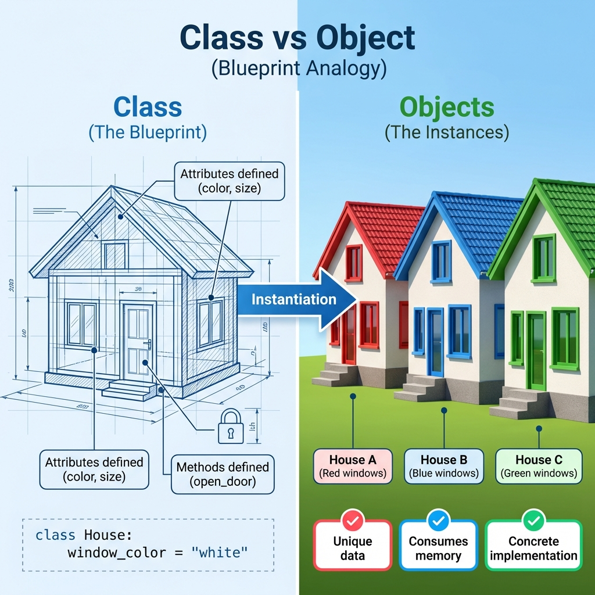
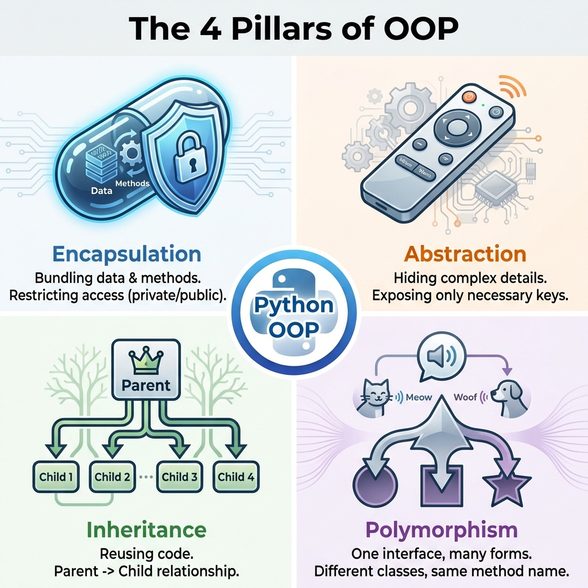
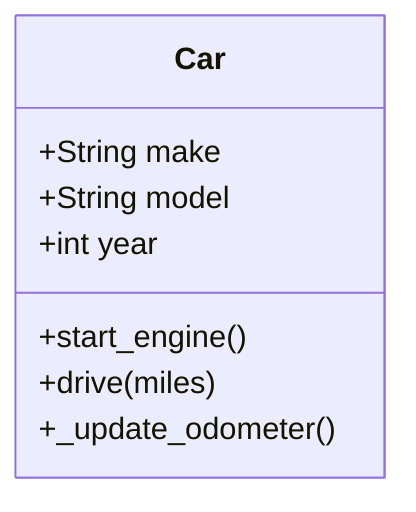
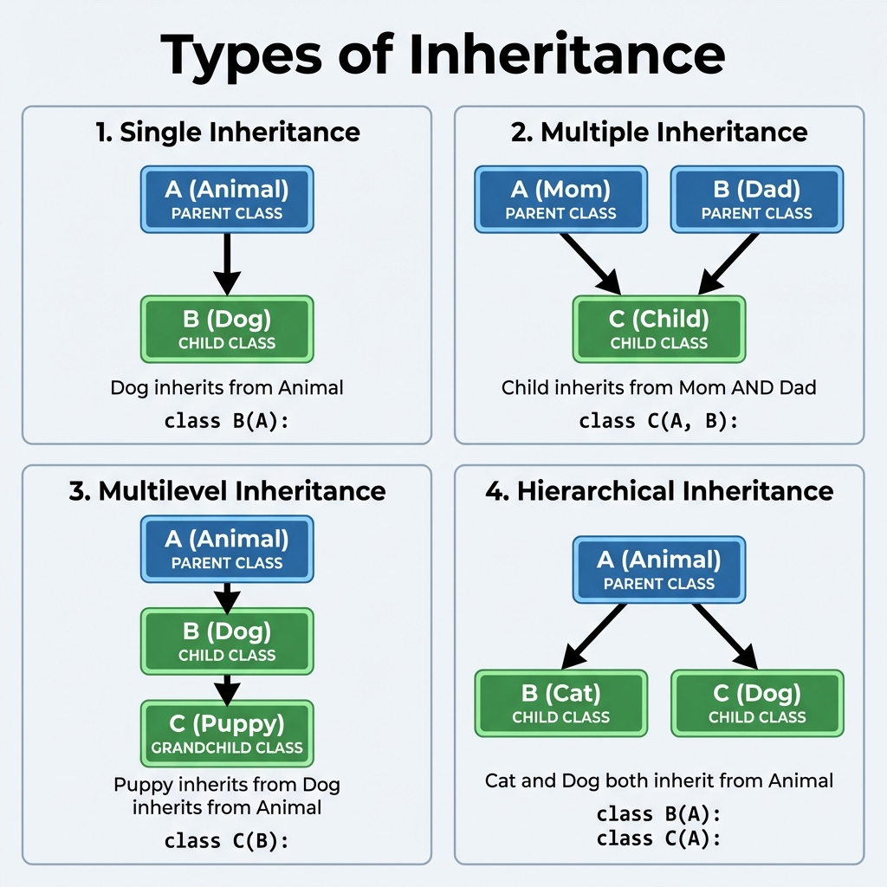
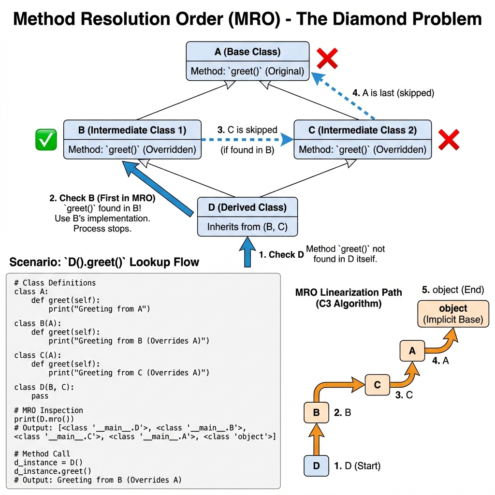

# Object-Oriented Programming (OOP) in Python

## 1. Topic Definition

**Object-Oriented Programming (OOP)** is a programming paradigm based on the concept of "objects", which can contain data (in the form of **attributes**) and code (in the form of **methods**). OOP aims to implement real-world entities like inheritance, hiding, polymorphism, etc. in programming.

### Core Concepts:
- **Class**: The blueprint or template (e.g., "Car" design).
- **Object**: The specific instance (e.g., "That Red Tesla Model S").
- **Attribute**: Data stored inside an object (variables).
- **Method**: Functions defined inside a class (actions).

## 2. Class vs Object



Think of a **Class** as an architectural blueprint for a house. It defines where walls go, dimensions, and window types.

Think of an **Object** as the actual house built from that blueprint. You can build unlimited houses (objects) from one blueprint. Each house has unique data (address, owner, paint color), but they all follow the same structure.

## 3. The 4 Pillars of OOP

Python's OOP is built on four foundational pillars:



### 1. Encapsulation
Bundling data and methods that work on that data within one unit. It often involves restricting access to internal object components.
- **Analogy**: A capsule medicine. You swallow it to get the result, but you don't mess with the chemicals inside.
- **In Python**: Using `_protected` (convention) or `__private` (name mangling) attributes.

### 2. Abstraction
Hiding complex implementation details and showing only the necessary features of an object.
- **Analogy**: A car dashboard. You use the steering wheel and pedals, unaware of the complex engine combustion mechanics.
- **In Python**: Abstract Base Classes (ABCs).

### 3. Inheritance
The mechanism where a new class inherits properties and behavior from an existing class.
- **Analogy**: A Child inherits traits (eye color, height) from Parents.
- **In Python**: `class Child(Parent):`.

### 4. Polymorphism
The ability to present the same interface for differing underlying forms (data types).
- **Analogy**: A "Speak" command. A Dog might "Woof", a Cat "Meows", and a Duck "Quacks". Same command, different behavior.
- **In Python**: Method overriding, Duck Typing.

## 4. Basic Syntax & Structure

### Diagram: Class Anatomy


### Code Structure:
```python
class Car:
    # Class Attribute (Shared by all instances)
    wheels = 4

    def __init__(self, make, model):
        # Instance Attributes (Unique to each object)
        self.make = make
        self.model = model
        self.odometer = 0  # Default value

    # Instance Method
    def drive(self, miles):
        self.odometer += miles
        return f"{self.make} driving {miles} miles."

    # Dunder (Magic) Method
    def __str__(self):
        return f"{self.make} {self.model}"
```

## 5. Inheritance Patterns

Python supports multiple types of inheritance options:



```python
# Parent Class (Base)
class Animal:
    def speak(self):
        pass

# Child Class (Derived) - Single Inheritance
class Dog(Animal):
    def speak(self):
        return "Woof"

# Multilevel Inheritance
class Puppy(Dog):
    def weep(self):
        return "Whimper"
```

### Method Resolution Order (MRO)
When a class inherits from multiple parents, Python uses **MRO (C3 Linearization)** to decide which method to call.



```python
print(Puppy.mro())
# [<class 'Puppy'>, <class 'Dog'>, <class 'Animal'>, <class 'object'>]
```

## 6. Magic Methods (Dunder Methods)

"Dunder" stands for "Double UNDERscore". These methods allow you to define how objects behave with built-in operations.

| Method | Description | Triggered By |
|--------|-------------|--------------|
| `__init__` | Constructor | `obj = Class()` |
| `__str__` | String representation (User friendly) | `print(obj)`, `str(obj)` |
| `__repr__` | String representation (Dev friendly) | `repr(obj)`, interactive console |
| `__len__` | Length of object | `len(obj)` |
| `__eq__` | Equality check | `obj1 == obj2` |
| `__add__` | Addition | `obj1 + obj2` |
| `__getitem__` | Indexing | `obj[key]` |

## 7. Advanced Class Features

### Properties (Getters/Setters)
Use the `@property` decorator to control attribute access pythonically.

```python
class Circle:
    def __init__(self, radius):
        self._radius = radius

    @property
    def radius(self):
        return self._radius

    @radius.setter
    def radius(self, value):
        if value < 0:
            raise ValueError("Radius cannot be negative")
        self._radius = value
```

### Class vs Static Methods

- **@classmethod**: Takes `cls` as the first argument. Can access class state.
- **@staticmethod**: Takes neither `self` nor `cls`. Just a regular function inside a class namespace.

```python
class Date:
    def __init__(self, day, month, year):
        self.day = day
        # ...

    @classmethod
    def from_string(cls, date_str):
        day, month, year = map(int, date_str.split('-'))
        return cls(day, month, year)

    @staticmethod
    def is_valid_date(date_str):
        # Validation logic
        return True
```

## 8. Best Practices (SOLID)

1.  **S**ingle Responsibility: A class should do one thing.
2.  **O**pen/Closed: Open for extension, closed for modification.
3.  **L**iskov Substitution: Child classes must be substitutable for parents.
4.  **I**nterface Segregation: Many specific interfaces are better than one general-purpose one.
5.  **D**ependency Inversion: Depend on abstractions, not concretions.

## 9. Common Pitfalls
- **Mutable Class Attributes**: Modifying `list` or `dict` class attributes affects ALL instances.
- **Super() Misuse**: Forgeting to call `super().__init__()` in child classes.
- **Over-Engineering**: Creating classes when a simple function or dictionary would suffice.

## 10. Step-by-Step Explanation
See **examples.py** for working code demonstrations.

## 11. Chapter Layout
- **examples.py**: Core concepts implementation.
- **exercises.py**: Practice problems from Easy to Hard.
- **solutions.py**: Detailed answers.
- **summary.md**: Quick reference guide.

## 12. References & Further Reading
- **Official Documentation**: [Python 3 Classes](https://docs.python.org/3/tutorial/classes.html) - The authoritative source.
- **Real Python**: [Object-Oriented Programming (OOP) in Python 3](https://realpython.com/python3-object-oriented-programming/) - Comprehensive guide.
- **GeeksforGeeks**: [Python OOPs Concepts](https://www.geeksforgeeks.org/python-oops-concepts/) - Good for quick examples.
- **Programiz**: [Python Object Oriented Programming](https://www.programiz.com/python-programming/object-oriented-programming) - Beginner friendly.
