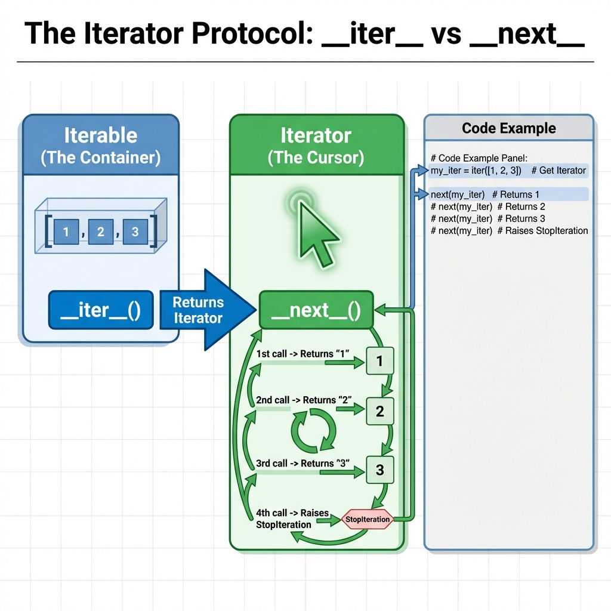
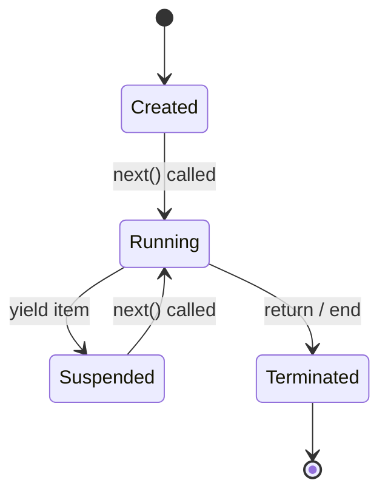
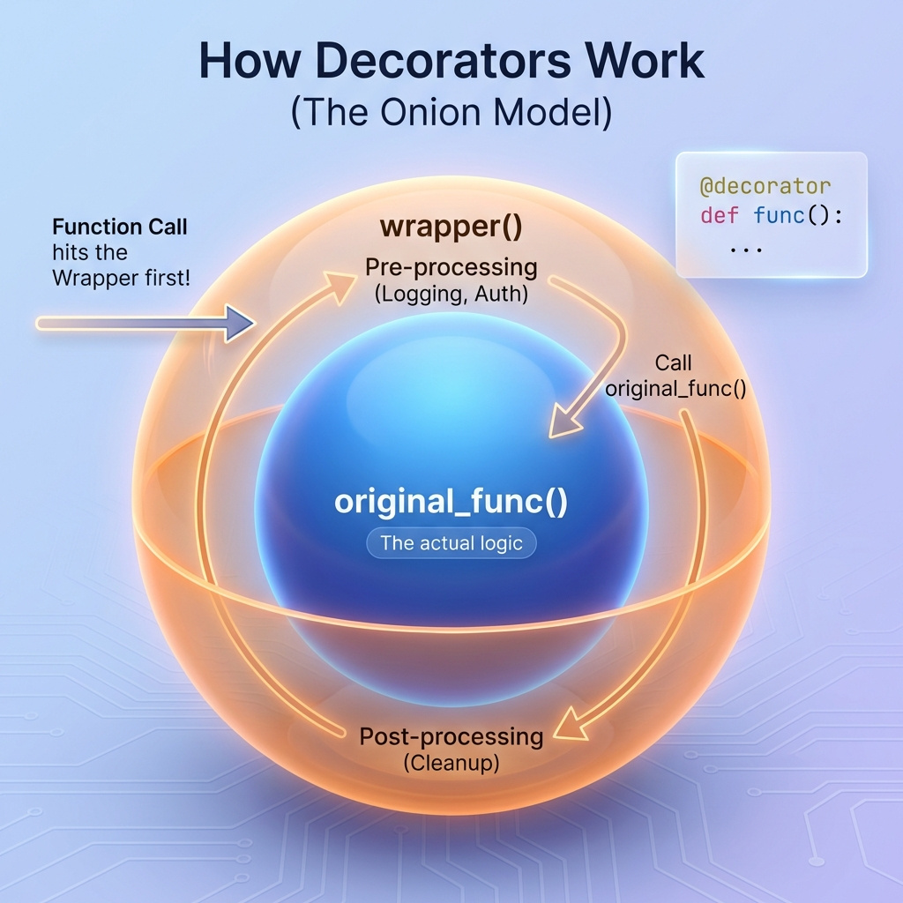
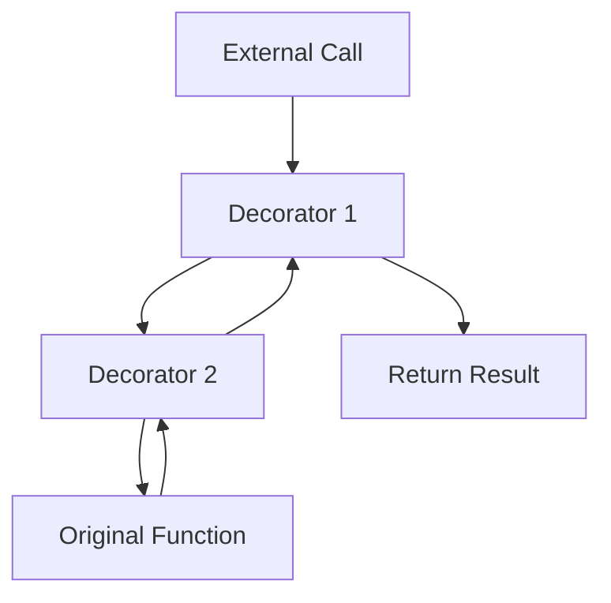
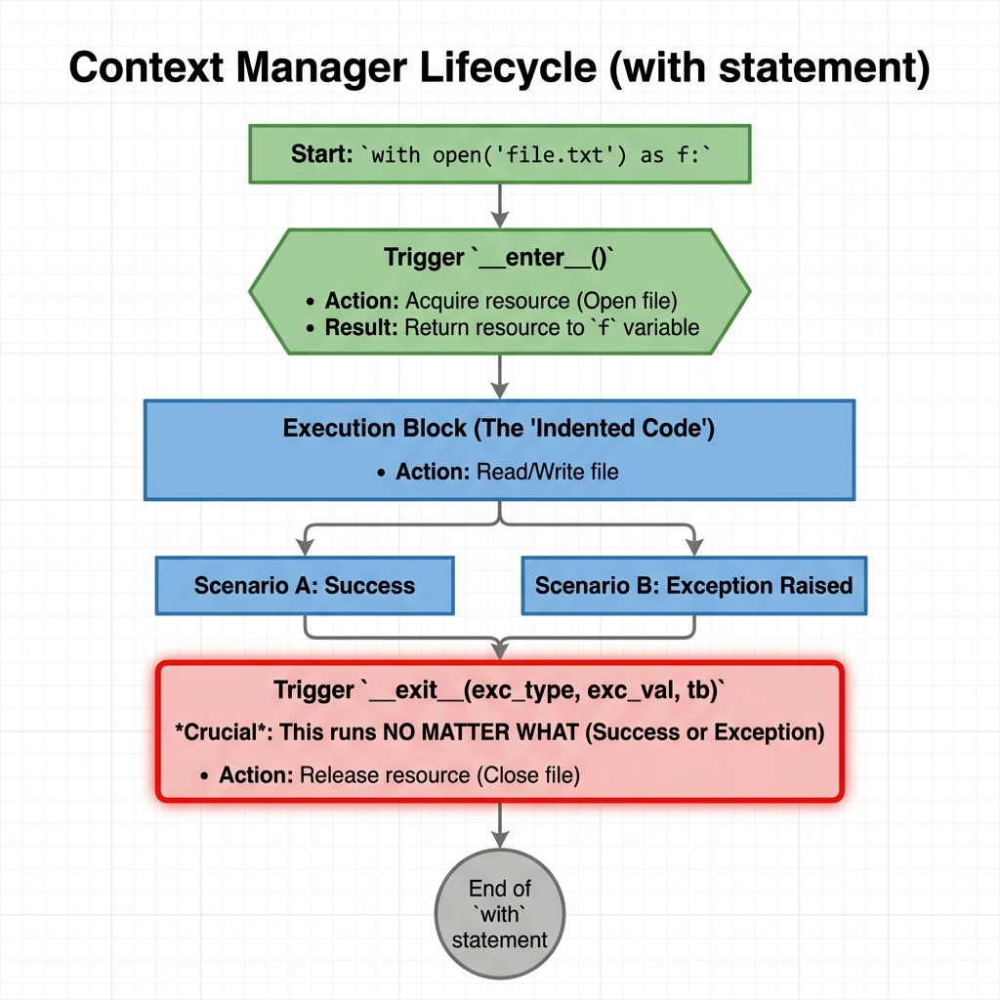
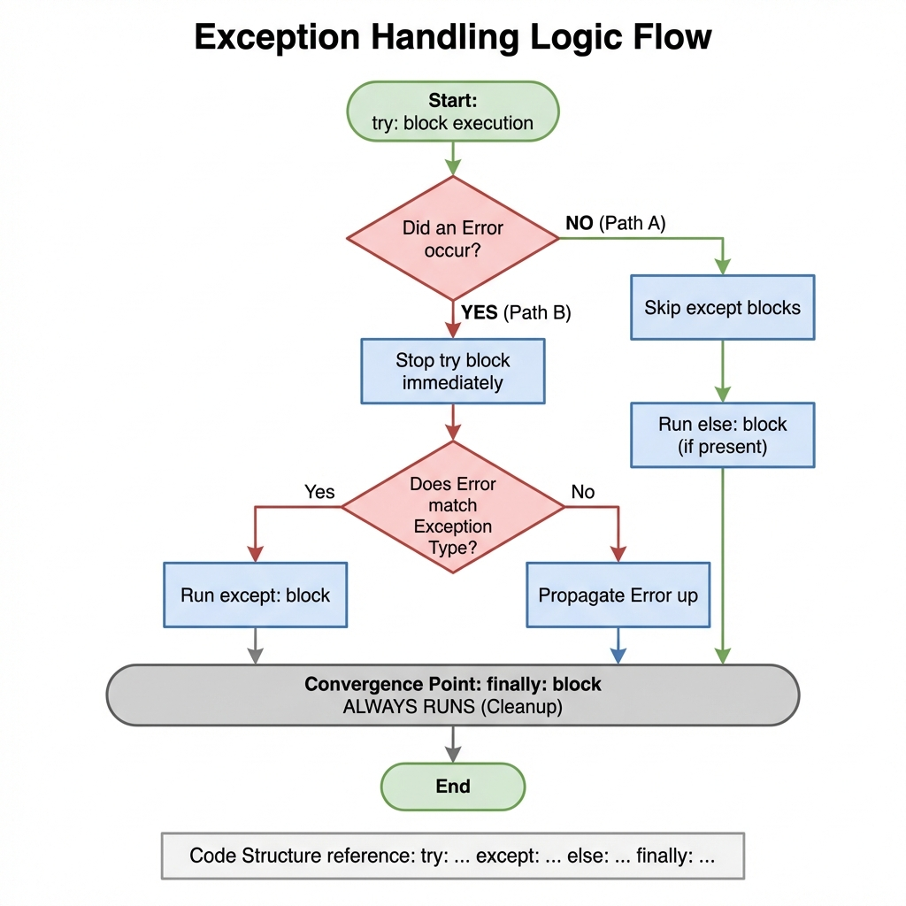
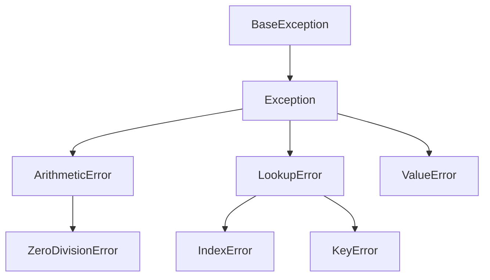

# Advanced Python Topics

## 1. Topic Definition

This chapter covers **Advanced Python Concepts** that transform you from a basic scripter to a professional developer. These features allow you to write code that is more efficient, readable, and robust.

### Key Concepts:
- **Iterators & Generators**: Lazy evaluation for memory efficiency.
- **Decorators**: Metaprogramming to modify function behavior.
- **Context Managers**: Automatic resource management (`with` statement).
- **Error Handling**: Robust exception management patterns.
- **Functional Tools**: `lambda`, `map`, `filter`, `reduce`.

## 2. Iterators and Generators

### The Iterator Protocol
Python's `for` loop works on any object that implements the **Iterator Protocol**.



- **Iterable**: An object with `__iter__()` (e.g., list, str).
- **Iterator**: An object with `__next__()` that remembers state.

### Generators (`yield`)
Generators are a simple way to create iterators. Instead of returning all data at once, they `yield` one item at a time, pausing execution.

```python
def count_up_to(n):
    count = 1
    while count <= n:
        yield count  # Pauses here
        count += 1
```

**Why usage Generators?**
- **Memory Efficiency**: Read a 10GB file line-by-line without loading it all.
- **Infinite Sequences**: Generate data streams that never end.

### Generator State Machine


## 3. Decorators

Decorators allow you to "wrap" a function with another function to extend its behavior without modifying the original code.



### Syntax
```python
@my_decorator
def say_hello():
    print("Hello!")

# Equivalent to:
say_hello = my_decorator(say_hello)
```

### Creating specific Decorator
```python
def timer(func):
    def wrapper(*args, **kwargs):
        start = time.time()
        result = func(*args, **kwargs)
        end = time.time()
        print(f"Executed in {end-start}s")
        return result
    return wrapper
```

### Decorator Stack
When multiple decorators are applied, they stack like onion layers.


## 4. Context Managers (`with` statement)

Context managers ensure resources are properly acquired and released, even if errors occur.



### The `with` Statement
```python
with open('file.txt', 'w') as f:
    f.write('Hello')
# f.close() is called automatically here!
```

### Implementing Custom Context Managers
You need `__enter__` and `__exit__` methods.
```python
class FileManager:
    def __init__(self, filename, mode):
        self.filename = filename
        self.mode = mode
    
    def __enter__(self):
        self.file = open(self.filename, self.mode)
        return self.file
    
    def __exit__(self, exc_type, exc_val, exc_tb):
        self.file.close()
```

## 5. Error Handling Patterns

Writing robust code requires handling the unexpected.



### The Full Pattern
```python
try:
    # Risky code
    result = 10 / 0
except ZeroDivisionError:
    # Handle specific error
    print("Cannot divide by zero!")
except Exception as e:
    # Handle generic error
    print(f"Unknown error: {e}")
else:
    # Runs ONLY if no exception occurred
    print("Calculation successful")
finally:
    # Runs ALWAYS (cleanup)
    print("Operation complete")
```

### Exception Hierarchy


## 6. Functional Programming Tools

### Lambda Functions
Anonymous, single-line functions.
```python
square = lambda x: x ** 2
print(square(5))  # 25
```

### Map, Filter, Reduce
- **Map**: Apply function to all items.
- **Filter**: Keep items where function returns True.
- **Reduce**: Combine all items into one value.

```python
nums = [1, 2, 3, 4]
squared = list(map(lambda x: x**2, nums))     # [1, 4, 9, 16]
evens = list(filter(lambda x: x%2==0, nums))  # [2, 4]
```

### Comprehensions
Pythonic way to create collections.
```python
# List Comprehension
squares = [x**2 for x in range(10)]

# Dictionary Comprehension
square_map = {x: x**2 for x in range(5)}
```

## 7. Step-by-Step Explanation
See **examples.py** for working code demonstrations.

## 8. Chapter Layout
- **examples.py**: Core concepts implementation.
- **exercises.py**: Practice problems from Easy to Hard.
- **solutions.py**: Detailed answers.
- **summary.md**: Quick reference guide.
