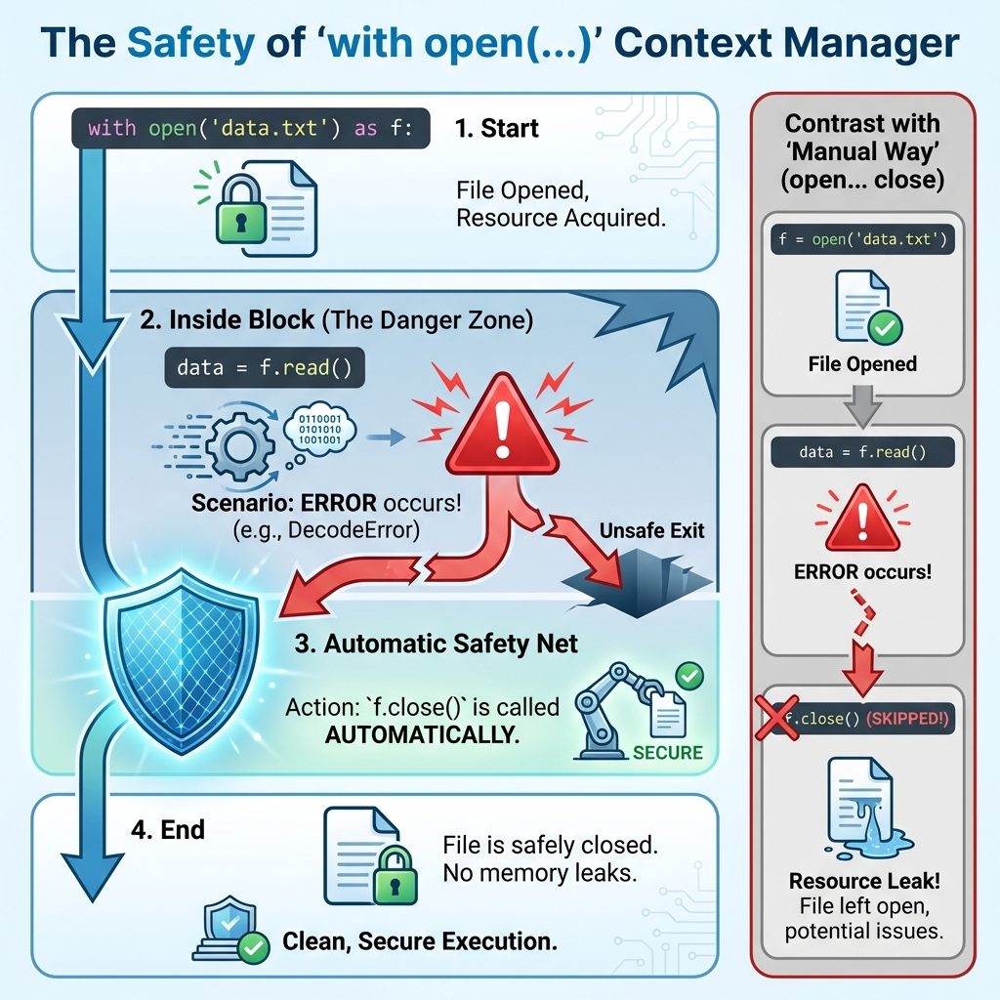
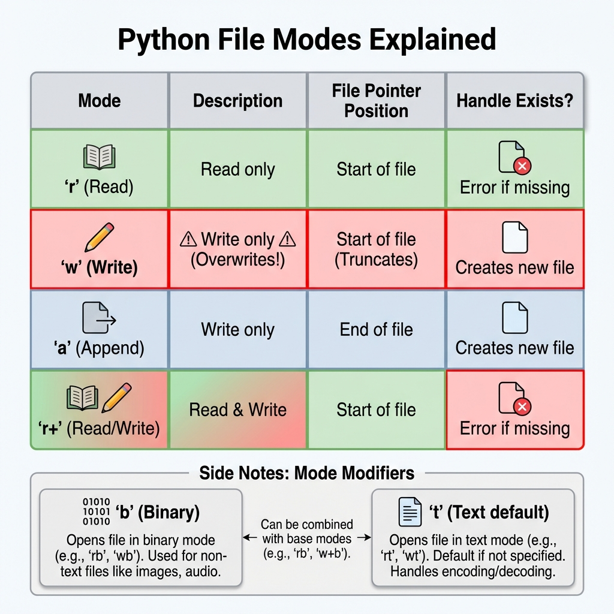
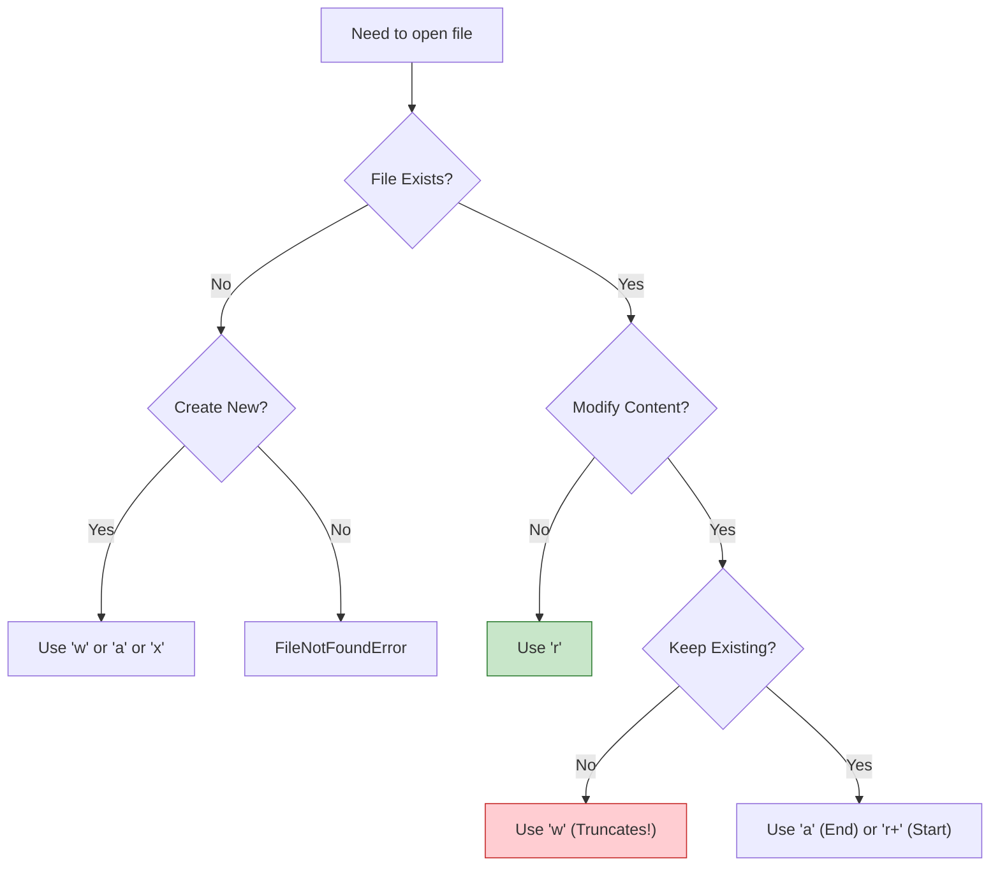
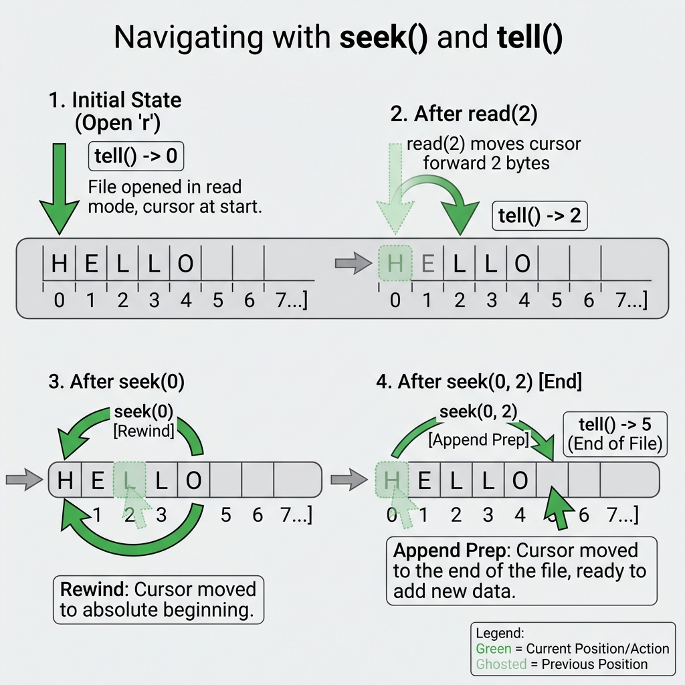

# File Handling in Python

## 1. Topic Definition

**File Handling** is the process of creating, reading, updating, and deleting files stored on persistent storage (hard drives, SSDs). Python uses **File Objects** (handles) to interact with the operating system's file system, allowing your programs to store data permanently.

### Key Concepts:
- **Persistence**: Data survives after program termination.
- **Streams**: Data flows in (Read) or out (Write) of your program.
- **Buffers**: Temporary memory storage for I/O efficiency.
- **Cursors**: A pointer indicating current read/write position.

## 2. The Context Manager (`with` statement)

The safest way to handle files is using the `with` statement (Context Manager). It ensures the file is **automatically closed** even if an error occurs.



```python
# The Safe Way (Recommended)
with open("data.txt", "r") as file:
    content = file.read()
# File is closed automatically here

# The Unsafe Way (Not Recommended)
file = open("data.txt", "r")
content = file.read()
file.close() # Might be skipped if error occurs above!
```

## 3. File Modes

Choosing the correct mode is critical. A wrong mode can delete your data instantly!



### Mode Evaluation Logic


- **`'r'` (Read)**: Default. Fails if missing. Pointer at start.
- **`'w'` (Write)**: **Overwrites** existing file! Creates if missing.
- **`'a'` (Append)**: Adds to end. Creates if missing. Safe for logs.
- **`'x'` (Create)**: Fails if file already exists.
- **`'b'` (Binary)**: Add to mode (e.g., `'wb'`) for images/audio.

## 4. Reading Files

Python offers three ways to read text files. Choose based on file size and need.


### 1. `.read()` - The Vacuum
Reads the **entire file** into a single string.
*⚠️ Warning: Can crash memory with huge files (GBs).*
```python
with open("log.txt", "r") as f:
    full_text = f.read()
```

### 2. `.readline()` - The Scanner
Reads **one line** at a time (memory efficient). Use inside a `while` loop or for headers.
```python
with open("config.txt", "r") as f:
    header = f.readline()
    print(header)
```

### 3. `.readlines()` - The List Maker
Reads everything into a **list of strings**.
```python
with open("todos.txt", "r") as f:
    lines = f.readlines()
    # ['Task 1\n', 'Task 2\n']
```

### Best Practice: Iteration
Iterating directly over the file object is the most Pythonic and efficient way (line-by-line).
```python
with open("large_log.txt", "r") as f:
    for line in f:
        print(line.strip())
```

## 5. Writing Files

- **`.write(string)`**: Writes a string. Returns characters written.
- **`.writelines(list)`**: Writes a list of strings (Does NOT add newlines automatically!).

```python
lines = ["Line 1\n", "Line 2\n"]
with open("output.txt", "w", encoding="utf-8") as f:
    f.writelines(lines)
    f.write("Line 3\n")
```

## 6. File Pointer Navigation (`seek` and `tell`)

The file object maintains a "cursor". You can move it manually.



- **`tell()`**: Returns current byte position (int).
- **`seek(offset, whence)`**: Moves cursor.
    - `0`: Start of file (Default)
    - `1`: Current position (Binary mode only)
    - `2`: End of file (Binary mode only)

```python
with open("data.txt", "r") as f:
    print(f.read(5))   # Reads first 5 chars
    print(f.tell())    # Returns 5
    f.seek(0)          # Rewind to start
    print(f.read(5))   # Reads first 5 again
```

## 7. Structured Data (JSON & CSV)

Don't parse Strings manually! Use standard libraries.

### JSON (Key-Value)
```python
import json

data = {"name": "Alice", "score": 99}

# Write
with open("data.json", "w") as f:
    json.dump(data, f, indent=4)

# Read
with open("data.json", "r") as f:
    loaded = json.load(f)
```

### CSV (Tabular)
```python
import csv

# Write
with open("data.csv", "w", newline='') as f:
    writer = csv.writer(f)
    writer.writerow(["Name", "Score"])
    writer.writerow(["Alice", 99])

# Read
with open("data.csv", "r") as f:
    reader = csv.reader(f)
    for row in reader:
        print(row)
```

## 8. Modern Paths with `pathlib`

Stop using strings for paths! `pathlib` is object-oriented and cross-platform.

```python
from pathlib import Path

# Create path object
p = Path("folder") / "subfolder" / "file.txt"

# Check existence
if p.exists():
    text = p.read_text()  # Convenience method!

# Create directory
p.parent.mkdir(parents=True, exist_ok=True)
```

## 9. Common Pitfalls

- **Missing `encoding="utf-8"`**: Causes crashes on Windows with emojis/special chars.
- **Forgetting `f.close()`**: Avoid by using `with`.
- **Wrong Mode**: Using `'w'` instead of `'a'` wipes existing data.
- **Path Issues**: Hardcoding `C:\\User` fails on Mac/Linux. Use `pathlib`.

## 10. Step-by-Step Explanation
See **examples.py** for working code demonstrations.

## 11. Chapter Layout
- **examples.py**: Core concepts implementation.
- **exercises.py**: Practice problems from Easy to Hard.
- **solutions.py**: Detailed answers.
- **summary.md**: Quick reference guide.
